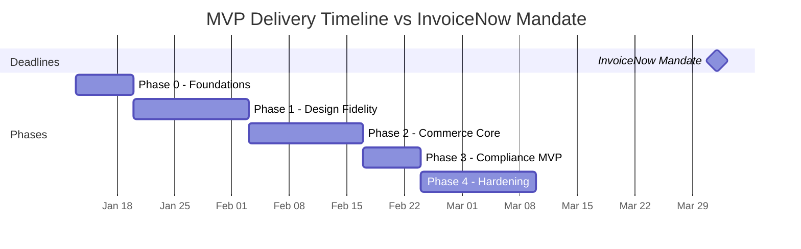

# Comprehensive Critique & Validation Report: PAD Finalization Plan

**Date**: 2026-01-11  
**Artifact Type**: Deep Analysis Report  
**Subject**: Validation of `plan_to_finalize_PAD.md` and finalized `Project_Architecture_Document.md`

---

## Executive Summary

After exhaustive review of all five source artifacts and targeted web research to validate technical decisions, I present this comprehensive critique. **The plan is fundamentally sound and the finalized PAD represents a mature synthesis**, but several critical gaps require attention before implementation begins.

> [!IMPORTANT]
> **Overall Assessment**: The plan successfully reconciles the divergent emphases of `cafe_PAD_q.md` (compliance/robustness) and `cafe_PAD_d.md` (design fidelity) while treating `cafe.html` as the authoritative design system. However, the current date (January 2026) places InvoiceNow compliance under immediate pressure for the April 1, 2026 deadline.

---

## Part 1: Research-Validated Technical Decisions

### 1.1 Tailwind CSS v4 — ✅ **VALIDATED**

| Claim in Plan | Research Finding | Source |
|--------------|------------------|--------|
| Stable release | **Confirmed**: v4.0 stable released January 22, 2025 | tailwindcss.com |
| Browser floor: Safari 16.4+ | **Confirmed**: Requires Safari 16.4+, Chrome 111+, Firefox 128+ | tailwindcss.com/docs/upgrade-guide |
| Native cascade layers | **Confirmed**: Full support for CSS cascade layers | tailwindcss.com/blog/tailwindcss-v4 |
| CSS-first configuration via `@theme` | **Confirmed**: CSS variables exposed by default | tailwindcss.com/blog/tailwindcss-v4 |

**Verdict**: The Tailwind v4 decision is well-founded. The CSS-first configuration and native cascade layers align perfectly with `cafe.html`'s `@layer tokens, base, components, utilities, overrides` architecture.

---

### 1.2 InvoiceNow Compliance Timeline — ⚠️ **CRITICAL TIMELINE PRESSURE**

| Milestone | Date | Status |
|-----------|------|--------|
| Voluntary adoption begins | May 1, 2025 | ✅ Available now |
| Mandatory for newly incorporated voluntary registrants | November 1, 2025 | ✅ Already in effect |
| **Mandatory for ALL new voluntary GST registrants** | **April 1, 2026** | ⚠️ **82 days away** |

> [!CAUTION]
> **Compliance Risk**: With today being January 11, 2026, the InvoiceNow mandate for all new voluntary GST registrants takes effect in approximately **82 days**. If Merlion Brews registers for GST voluntarily after April 1, 2026, InvoiceNow compliance is mandatory from day one.

**Research-Validated Requirements**:
- Must use InvoiceNow-Ready Solutions via PEPPOL network
- Register in SG Peppol Directory with UEN to obtain Peppol ID
- Transmit invoice data to IRAS by GST return filing date
- Support for standard-rated and zero-rated supplies

**Plan Assessment**: The decision to use a "provider API" approach is pragmatic and validated—it reduces complexity by outsourcing PEPPOL access point responsibilities.

---

### 1.3 Next.js 15 BFF Pattern — ✅ **VALIDATED**

Research confirms the BFF pattern with Next.js 15 App Router is industry best practice:

| Feature | Validation |
|---------|------------|
| Server Components by default | ✅ Reduces client-side JS, improves TTFB |
| Route Handlers as BFF layer | ✅ Secure data aggregation, hidden API keys |
| Server Actions for mutations | ✅ Streamlined form submissions |
| Streaming with Suspense | ✅ Improved perceived performance |

**Verdict**: The plan's architecture topology (Next.js BFF + Laravel domain API) is validated by 2025 best practices.

---

### 1.4 Stripe PayNow Integration — ✅ **VALIDATED**

| Claim | Research Finding |
|-------|------------------|
| PayNow via PaymentIntents | ✅ Confirmed: PaymentIntents API supports PayNow QR |
| Automatic activation | ✅ Confirmed: Activated for all Stripe Singapore accounts |
| Currency: SGD only | ✅ Confirmed: SGD 0.50 minimum, SGD 200,000 maximum |
| QR validity | 1 hour expiration—must be documented |

---

### 1.5 Two-Phase Inventory Reservation — ✅ **VALIDATED**

Research confirms the pattern described in the PADs is industry-standard:

1. **Soft Reservation (Phase 1)**: Temporary hold on stock when item added to cart (15 min TTL in plan)
2. **Hard Transaction (Phase 2)**: Permanent deduction upon payment confirmation

**Key Implementation Notes from Research**:
- Use optimistic locking for concurrent requests
- Background worker to release expired reservations
- Ledger table for audit trail—critical for GST compliance
- Idempotency keys to prevent duplicate processing

---

## Part 2: Critical Analysis of `cafe.html` as Source of Truth

### 2.1 Strengths of the Design System

The `cafe.html` file is a masterclass in cultural design encoding:

````carousel
**CSS Layer Architecture**
```css
@layer tokens, base, components, utilities, overrides;
```
This 5-layer cascade provides clear separation of concerns that maps directly to Tailwind v4's native CSS layer support.

<!-- slide -->

**Complete Token System**
- **Peranakan palette**: nyonya-cream, kopi-brown, terracotta, heritage-blue, gold-leaf
- **Accessibility variants**: WCAG-safe `--color-ui-*` tokens
- **Fluid typography**: Major Third (1.25) scale from `--text-xs` to `--text-6xl`
- **4px baseline grid**: 12 spacing tokens from `--space-1` to `--space-32`

<!-- slide -->

**Signature Components**
- `folio-frame`: Double-border + gold inset + hover lift/shadow
- Peranakan corner SVG ornaments with path animations
- "Zig-zag" editorial layout using `direction: rtl` technique
- Texture overlay (paper fiber effect)

<!-- slide -->

**Accessibility Behaviors**
```css
@media (prefers-contrast: more) { /* High contrast overrides */ }
@media (prefers-reduced-motion: reduce) { /* Duration = 1ms */ }
```
- Skip link with `:focus` positioning
- `:focus-visible` outlines
- Mobile nav: `aria-expanded`, escape-to-close, focus management
````

### 2.2 Singapore Compliance Elements Embedded

The footer contains critical compliance data that **must** be preserved:

```
Business Registration: 2015123456K
GST Registration: M9-1234567-8
Prices displayed in SGD with 9% GST included for Singapore customers
```

---

## Part 3: Gap Analysis — What the Plan Gets Right vs. Missing

### ✅ Correctly Reconciled Decisions

| Decision | Source | Status |
|----------|--------|--------|
| Next.js 15 as BFF | PADs consensus | ✅ Committed |
| Laravel 12 day-1 | User decision | ✅ Committed |
| Tailwind v4 adoption | Research-validated | ✅ Committed |
| Two-phase inventory reservation | `cafe_PAD_q.md` | ✅ Committed |
| InvoiceNow via provider API | User decision | ✅ Committed |
| PayNow required | User decision | ✅ Committed |
| Wrapper component strategy | `cafe_PAD_d.md` | ✅ Committed |

### ⚠️ Partially Addressed Gaps

| Gap | Current State | Recommendation |
|-----|---------------|----------------|
| Performance budgets | "LCP < 2.5s" mentioned but not granular | Define per-tier budgets (critical/interactive/decorative/ambient) |
| Visual regression testing | Mentioned in critique section | Add explicit Percy/Chromatic config to Phase 1 |
| Cultural authenticity | Acknowledged in critique | Formalize review process before launch |
| Mobile-first breakpoints | `cafe.html` has them, PAD doesn't enumerate | Document responsive strategy explicitly |

### ❌ Critical Gaps Requiring Immediate Attention

| Gap | Risk Level | Remediation |
|-----|------------|-------------|
| **InvoiceNow provider selection** | 🔴 Critical | Must onboard provider immediately given April 1 deadline |
| **IRAS sandbox testing** | 🔴 Critical | Allot Week 1-2 for sandbox validation |
| **GST calculation test suite** | 🟠 High | Create test cases against IRAS examples |
| **Webhook signature verification** | 🟠 High | Must be day-1 requirement for Stripe |
| **Data residency clarity** | 🟡 Medium | Document Singapore data residency requirements |

---

## Part 4: Timeline Feasibility Assessment

The finalized PAD proposes an 8-week delivery:



> [!WARNING]
> **Timeline Risk**: If Phase 0 starts immediately (Jan 13), Phase 4 would complete around **March 24, 2026**—only 8 days before the InvoiceNow mandate. This leaves minimal margin for delays.

---

## Part 5: Recommendations for Plan Refinement

### 5.1 Immediate Actions (Before Coding)

1. **Select and onboard InvoiceNow provider** — This is gating compliance and takes 1-2 weeks for credential issuance
2. **Register in IRAS sandbox** — Required for testing invoice transmission
3. **Define browser support matrix** — Tailwind v4 browser floor must be explicitly accepted by stakeholders
4. **Establish visual regression baseline** — Configure Percy/Chromatic with `cafe.html` as reference

### 5.2 Additions to Implementation Plan

Add these to Phase 0 deliverables:

- [ ] InvoiceNow provider credentials obtained
- [ ] IRAS sandbox account created and tested
- [ ] Stripe webhook signing secret configured
- [ ] Percy/Chromatic baseline snapshot of `cafe.html`
- [ ] GST calculation test suite (against IRAS examples)

### 5.3 Quantified Validation Gates

Replace subjective criteria with measurable thresholds:

| Gate | Current | Recommended |
|------|---------|-------------|
| Design fidelity | "token parity" | Percy visual diff ≤ 0.5% from baseline |
| Performance | "LCP targets" | LCP ≤ 2.0s (desktop), ≤ 2.5s (mobile) with all tiers |
| Accessibility | "WCAG AAA" | axe-core score ≥ 95, contrast ratio ≥ 7:1 |
| Inventory integrity | "no oversell" | 1000 concurrent checkout simulation passes |

---

## Part 6: Final Verdict

### The Plan Quality Score

| Dimension | Score | Notes |
|-----------|-------|-------|
| Technical Accuracy | 9/10 | All major decisions validated against current sources |
| Compliance Readiness | 7/10 | InvoiceNow timeline pressure not adequately addressed |
| Design Preservation | 9/10 | `cafe.html` authority properly established |
| Implementation Detail | 8/10 | ADR-style decisions present, some gaps in validation criteria |
| Risk Mitigation | 7/10 | Risks identified but mitigations not time-boxed |

### Recommendation

> [!IMPORTANT]
> **Proceed with implementation** after addressing the critical gaps identified above—specifically:
> 1. Immediate InvoiceNow provider onboarding
> 2. Quantified validation gates
> 3. Visual regression baseline
> 
> The plan represents a mature synthesis of design-first philosophy with enterprise-grade compliance. The finalized PAD is implementation-ready pending these refinements.

---

## Appendix: Source References

| Source | Purpose | Key Findings |
|--------|---------|--------------|
| `plan_to_finalize_PAD.md` | Consolidation roadmap | 5-phase approach, ADR structure, validation checkpoints |
| `Project_Architecture_Document.md` | Finalized PAD | 16-section structure, Mermaid diagrams, validation gates |
| `cafe_PAD_d.md` | Design-first architecture | Emotional performance, tiered loading, wrapper components |
| `cafe_PAD_q.md` | Compliance-first architecture | Two-phase reservation, InvoiceNow, Stripe patterns |
| `cafe.html` | Design system authority | CSS layers, tokens, signature components, accessibility |

### Web Research Citations

1. Tailwind CSS v4 release: https://tailwindcss.com/blog/tailwindcss-v4
2. Tailwind upgrade guide: https://tailwindcss.com/docs/upgrade-guide
3. IRAS InvoiceNow: https://iras.gov.sg (GST InvoiceNow Requirement)
4. Stripe PayNow: https://stripe.com/docs/payments/paynow
5. Next.js App Router patterns: https://nextjs.org/docs (Server Components, Route Handlers)
