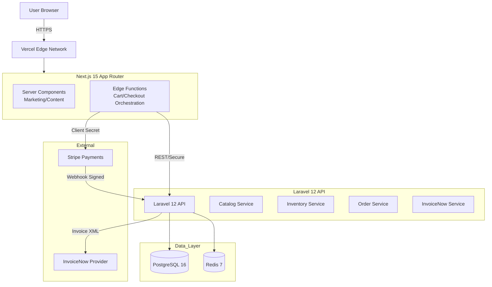

# Project Architecture Document (PAD)
## Merlion Brews — Artisan Coffee Crafted with Peranakan Soul

**Document Status**: Finalized
**Date**: January 11, 2026
**Version**: 2.0 (Authoritative)

---

## 1. Executive Summary
Merlion Brews is a Singapore-first, design-led headless commerce platform that preserves the bespoke Peranakan aesthetic defined in `cafe.html` while providing enterprise-grade transactional integrity and compliance. The system uses **Next.js 15 (App Router)** as a storefront **BFF** and rendering layer, **Laravel 12 (PHP 8.3+)** as the day‑1 domain API, **PostgreSQL 16** as the system of record with **two-phase inventory reservation + ledger auditing**, and **Stripe** as the payment processor with **PayNow** enabled via PaymentIntents. GST (9%) is treated as a first-class requirement across pricing display, order totals, and invoicing. For e‑invoicing, **InvoiceNow is in-scope for MVP** and will be implemented via an **InvoiceNow-ready provider API**, with auditability, retry, and reconciliation built in. This ensures readiness for the **April 1, 2026** mandate for new voluntary GST registrants.

---

## 2. Goals, Non-goals, and Assumptions

### 2.1 Goals
- **Aesthetic Fidelity First**: Preserve the **design system and interaction behaviors** encoded in `cafe.html` as architectural constraints.
  - CSS layer architecture (`@layer tokens, base, components, utilities, overrides`).
  - Tokenized Peranakan palette with accessibility variants.
  - Signature components: `folio-frame` (double-border + gold inset), Peranakan ornaments (SVG paths), zig-zag editorial layouts (`direction: rtl`).
  - "Emotional Performance": Micro-interactions (floating beans, scroll reveal) must trigger perceived value, not just load speed.
- **Commerce Integrity**: Ship an MVP with:
  - Full commerce: browse products, cart, checkout, receipt/invoice.
  - **Stripe + PayNow** (Required).
  - Inventory oversell prevention via **Two-Phase Reservation**.
- **Compliance Hardening**:
  - GST-inclusive display and compliant invoice data (9% rate).
  - InvoiceNow transmission via provider API (MVP).
  - PDPA consent controls.

### 2.2 Non-goals (MVP)
- Multi-warehouse fulfillment and advanced OMS.
- Custom payment processing outside Stripe.
- Multi-currency pricing beyond SGD.
- Full event-sourcing infrastructure (we use a ledger for auditability instead).

### 2.3 Assumptions & Constraints
- **Browser Floor**: Tailwind CSS v4 targets modern browsers (Safari 16.4+, Chrome 111+, Firefox 128+). We explicitly accept this to leverage native cascade layers and `@property`.
- **Backend Day-1**: We accept the operational overhead of Laravel/Postgres from the start to ensure compliance (InvoiceNow) and integrity (Inventory) are robust, rather than refactoring from serverless later.

---

## 3. Source-of-Truth Map (Authoritative Inputs)

### 3.1 UI / Design System / Interaction Authority
**Authoritative Artifact**: `cafe.html`

The following are **non-negotiable requirements**:
- **CSS Architecture**: `@layer tokens, base, components, utilities, overrides` must be preserved.
- **Typography**: Cormorant Garamond (Headings), Crimson Pro (Body), Pinyon Script (Accents).
- **Colors**: Nyonya Cream (`#F8F3E6`), Kopi Brown (`#3A2A1F`), Terracotta (`#C77966`), Heritage Blue (`#4A6B7D`), Gold Leaf (`#D4AF37`).
- **Behaviors**: 
  - Mobile nav with `aria-expanded` and focus trapping.
  - Floating coffee bean animation (`float` keyframe).
  - Texture overlay (fixed position, pointer-events-none).

### 3.2 Architecture & Domain Authority
**Authoritative Artifacts**: `cafe_PAD_q.md` and `cafe_PAD_d.md` (Reconciled)

- **Topology**: Next.js (BFF) + Laravel (Domain).
- **Inventory**: Two-phase reservation (Reserve -> Commit) + Ledger.
- **Payments**: Stripe PaymentIntents with PayNow + Webhook Signature Verification.

### 3.3 Business Registration + GST IDs
**Authoritative Artifact**: `cafe.html`

- Business Registration: **2015123456K**
- GST Registration: **M9-1234567-8**

---

## 4. Architecture Decision Records (ADRs)

### ADR-001 — Next.js as BFF (Committed)
- **Decision**: Next.js 15 App Router acts as storefront renderer and BFF.
- **Rationale**: Server Components for fast TTFB on marketing pages; Edge Functions for low-latency cart/checkout orchestration; strict separation of concerns from the Domain API.

### ADR-002 — Laravel + Postgres Day‑1 (Committed)
- **Decision**: Laravel 12 and Postgres 16 are implemented immediately.
- **Rationale**: Compliance requirements (InvoiceNow, GST audit trails) and Transactional Integrity (Inventory locking) are too complex to defer. We trade initial velocity for architectural stability.

### ADR-003 — Tailwind CSS v4 (Committed)
- **Decision**: Use Tailwind CSS v4.
- **Rationale**: Native support for `@layer` aligns perfectly with `cafe.html`'s architecture. CSS-first configuration (`@theme`) simplifies the Design Token Bridge.

### ADR-004 — Inventory Integrity via Two-Phase Reservation (Committed)
- **Decision**: Implement `reserve` (TTL-based) and `commit` (Payment-confirmed) phases, backed by an immutable ledger.
- **Rationale**: Prevents overselling during high-traffic drops; resolves race conditions better than simple atomic decrements.

### ADR-005 — InvoiceNow MVP via Provider API (Committed)
- **Decision**: Integrate with an InvoiceNow-ready provider’s API.
- **Rationale**: Direct Peppol access point implementation is out of scope for MVP. Provider API ensures compliance with minimal engineering overhead.

---

## 5. High-Level System Architecture

### 5.1 Container Diagram


### 5.2 Responsibilities
- **Next.js (BFF)**: 
  - Host the Design System (`@layer` architecture).
  - Orchestrate the "Emotional" experience (animations, transitions).
  - Manage ephemeral cart state.
- **Laravel (Domain)**:
  - Authoritative Product Catalog.
  - Inventory Ledger & Reservation logic.
  - Order Lifecycle & GST Calculation.
  - Webhook verification & Idempotency.
  - InvoiceNow transmission.

---

## 6. Frontend Architecture (Next.js 15)

### 6.1 Rendering & Caching
- **Marketing Pages (Home, Story)**: Static Generation (SSG) with ISR (revalidate: 3600).
- **Product Pages**: ISR (revalidate: 60) + Client Components for "Add to Cart".
- **Cart/Checkout**: Client Components interacting with Edge Functions.

### 6.2 Design Token Bridge (The "Soul" Pipeline)
To ensure strict adherence to `cafe.html`:
1.  **Extraction**: Tokens from `cafe.html` (colors, fonts, spacing) are extracted into a TypeScript source of truth (`design-tokens.ts`).
2.  **Generation**: A build script converts TS tokens into a Tailwind v4 CSS theme configuration (`@theme`).
3.  **Consumption**: Components use Tailwind utilities that reference these semantic tokens (e.g., `text-nyonya-cream`, `animate-float`).

---

## 7. Component Architecture: "Merlion Wrappers"

### 7.1 Philosophy
**"Shadcn Primitives provide discipline. Merlion Wrappers provide soul."**
We do **not** use raw Shadcn components in page layouts. We use **Merlion Wrappers**.

### 7.2 Core Wrappers (Must Implement)
- **`CardMerlion`**: Extends Shadcn Card. Adds `.folio-frame` behavior (double border, gold inset, hover lift).
- **`ButtonMerlion`**: Extends Shadcn Button. Implements the specific hover underlay animation from `cafe.html`.
- **`MerlionImage`**: Next.js Image wrapper that applies the `folio-frame` and specific aspect ratios.
- **`ZigzagSection`**: Layout component implementing the `direction: rtl` / `direction: ltr` flipping logic for editorial flow.
- **`OrnamentSystem`**: SVG component handling the `peranakan-corner` paths, capable of positioning (TL, TR, BL, BR) and reduced-motion compliance.
- **`TextureOverlay`**: Global fixed component rendering the paper fiber noise.

---

## 8. Backend Architecture (Laravel 12)

### 8.1 Domain Services
- **Catalog**: Read-heavy. Cached in Redis.
- **Inventory**: Write-critical. Handles `reserve(sku, qty, ttl)` and `commit(reservation_id)`.
- **Order**: Handles GST calculation (9% inclusive extraction) and Order state machine.
- **Invoice**: Generates UBL/Peppol compliant XML payloads for the provider API.

### 8.2 Queueing & Jobs
- `ProcessStripeWebhook`: High priority. Verifies signature, checks idempotency, commits inventory.
- `PruneExpiredReservations`: Scheduled (every 5 mins). Releases stock from expired reservations.
- `TransmitInvoiceNow`: Retryable job with exponential backoff for IRAS transmission.

---

## 9. Data Architecture (PostgreSQL 16)

### 9.1 Schema: Inventory (Reservation + Ledger)
```sql
CREATE TABLE inventory (
  sku VARCHAR(50) PRIMARY KEY,
  stock_count INTEGER NOT NULL DEFAULT 0,
  reserved_count INTEGER NOT NULL DEFAULT 0
);

CREATE TABLE inventory_reservations (
  id UUID PRIMARY KEY,
  sku VARCHAR(50) REFERENCES inventory(sku),
  quantity INTEGER NOT NULL,
  expires_at TIMESTAMP NOT NULL,
  status VARCHAR(20) DEFAULT 'active' -- active, committed, expired
);

CREATE TABLE inventory_ledger (
  id UUID PRIMARY KEY,
  sku VARCHAR(50),
  quantity_change INTEGER,
  reason VARCHAR(50), -- reservation, commit, release, adjustment
  reference_id UUID,
  created_at TIMESTAMP DEFAULT NOW()
);
```

### 9.2 Schema: Orders & GST
- `orders` table **must** store:
  - `subtotal_cents`: integer
  - `gst_cents`: integer (explicitly calculated)
  - `total_cents`: integer
  - `gst_rate`: decimal (9.00)
  - `invoice_number`: string (unique, e.g., MB-2026-XXXX)

---

## 10. Checkout, Payments, and PayNow

### 10.1 Flow
1.  **Cart**: User clicks checkout. Next.js requests `PaymentIntent` from Laravel.
2.  **Laravel**: 
    - Creates `Order` (pending).
    - Extends `Reservation` TTL.
    - Calls Stripe API (`payment_method_types: ['card', 'paynow']`).
    - Returns `client_secret`.
3.  **Frontend**: Renders Stripe Payment Element (supporting PayNow QR). **Note**: QR code is valid for 1 hour; UI must handle expiration.
4.  **Webhook**: Stripe hits Laravel (`checkout.session.completed` or `payment_intent.succeeded`).
5.  **Reconciliation**: Laravel verifies signature -> Commits Reservation -> Generates Invoice -> Queues InvoiceNow transmission.

---

## 11. Compliance (GST, PDPA, InvoiceNow)

### 11.1 GST
- **Display**: "Prices include 9% GST".
- **Calculation**: Tax fraction = 9/109 of the gross price.
- **Invoice**: Must strictly follow IRAS tax invoice requirements.

### 11.2 InvoiceNow (MVP)
- **Strategy**: Provider API.
- **Requirement**: We must log the `transmission_id` and `status` returned by the provider for every invoice.

---

## 12. Performance & "Emotional Performance"

### 12.1 Tiered Budgets
- **Tier 1 (Critical)**: LCP < 2.5s. Text, Structure, Main Image.
- **Tier 2 (Interactive)**: FID < 100ms. Nav, Buttons.
- **Tier 3 (Emotional)**: Floating beans, texture overlay, scroll reveal. Loaded immediately but CSS-animated (GPU efficient).
- **Tier 4 (Ambient)**: Complex SVG paths. Lazy loaded if below fold.

### 12.2 Tailwind v4 Optimization
- Use `@theme` to inline tokens.
- Use native CSS layers to ensure "Overrides" (`@layer overrides`) always win over "Utilities".

---

## 13. Delivery Plan (MVP)

### Phase 0: Critical Compliance Setup (Week 0)
*Goal: Secure long-lead-time credentials.*
- **Deliverables**:
  - Select and contract InvoiceNow-ready provider.
  - Register for IRAS InvoiceNow sandbox.
  - Obtain Stripe Singapore credentials.

### Phase 1: The Design Foundation (Frontend Only)
*Goal: Perfect aesthetic fidelity before backend integration.*
- **Deliverables**: 
  - Next.js repo setup with Tailwind v4.
  - `design-tokens.ts` bridge implemented.
  - `Merlion` wrapper components built & visually tested against `cafe.html`.
  - Static pages (Home, Story) ported.
- **Gate**: Visual Regression Test (Percy/Snapshot) vs `cafe.html`.

### Phase 2: The Transactional Core (Backend)
*Goal: Inventory and Payment integrity.*
- **Deliverables**:
  - Laravel 12 setup + Postgres.
  - Inventory Services (Reservation/Ledger) implemented.
  - Stripe integration (PayNow/Webhooks).
  - GST Logic & Invoice Generation.

### Phase 3: Integration & Compliance
*Goal: Connecting the Brain to the Soul.*
- **Deliverables**:
  - Connect Next.js Cart to Laravel API.
  - Implement InvoiceNow provider integration.
  - End-to-end Checkout tests (PayNow flow).

### Phase 4: Hardening
- **Deliverables**:
  - Load testing (Inventory locking).
  - PDPA Consent banners.
  - Production Deployment (Vercel + AWS/DigitalOcean).

---

## 14. Validation Gates (Checklist)

### Pre-Code
- [ ] Tailwind v4 browser targets confirmed accepted.
- [ ] InvoiceNow provider selected and API keys obtained.

### Pre-Launch
- [ ] **Aesthetic**: `folio-frame` matches `cafe.html` double-border pixel-perfectly.
- [ ] **Interaction**: Mobile menu traps focus and supports ESC to close.
- [ ] **Inventory**: Concurrent checkout test (10 users, 1 item) results in 1 success, 9 failures (no oversell).
- [ ] **Payments**: Stripe Webhook signature verification is active and blocking unsigned requests.
- [ ] **GST**: Invoices generated show exactly 9% tax breakdown.
- [ ] **Performance**: LCP < 2.5s with "Floating Beans" enabled.

---

## Appendix A: Data Models
*Refer to Section 9 for Schema Definitions.*

## Appendix B: Key `cafe.html` Assets
*Floating Bean Animation*:
```css
@keyframes float {
    0%, 100% { transform: translateY(0) rotate(0deg); opacity: 0.3; }
    50% { transform: translateY(-20px) rotate(15deg); opacity: 0.6; }
}
```
*Folio Frame Styles*:
```css
.folio-frame {
    border: 1px solid rgba(var(--color-kopi-brown-rgb), 0.1);
}
.folio-frame::after {
    border: 1px solid rgba(var(--color-gold-leaf-rgb), 0.2);
    /* inset 8px */
}
```
