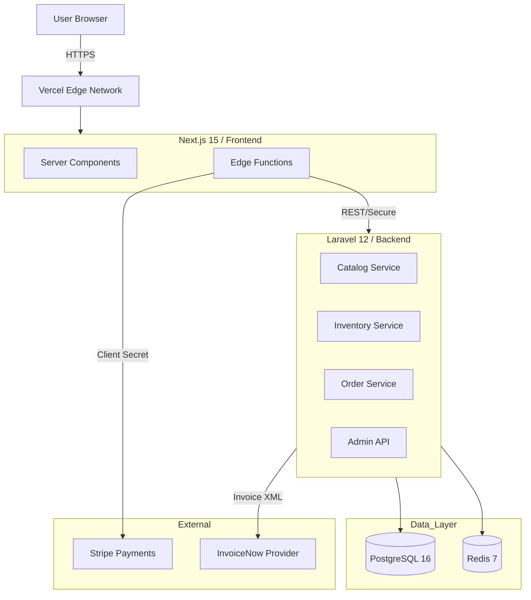

# Merlion Brews ☕️🇸🇬
### Artisan Coffee Crafted with Peranakan Soul & Enterprise Integrity


---

## 📖 The Vision

**Merlion Brews** is a Singapore-first, design-led headless commerce platform. It rejects the "template aesthetic" of modern e-commerce in favor of a bespoke **Peranakan Design System** defined in `cafe.html`, while enforcing rigorous enterprise standards for transactional integrity and local compliance.

We are building a bridge between **Heritage** (Aesthetic Fidelity) and **Scale** (Commerce Integrity).

## ✨ Key Features

### 🎨 Design System ("The Soul")
*   **Authoritative Source**: `cafe.html` dictates all tokens, layers, and behaviors.
*   **Merlion Wrappers**: Custom components (e.g., `folio-frame`, `button-merlion`) wrapping Shadcn primitives to enforce the double-border gold-inset aesthetic.
*   **Parity Components**: Bespoke implementations of `DropCap`, `PeranakanDivider`, and `ScrollIndicator` to match the original design fidelity.
*   **Emotional Performance**: Micro-interactions (floating beans, scroll reveals) treated as first-class citizens alongside Core Web Vitals.
*   **Accessibility First**: WCAG AAA contrast compliance, reduced motion support (disabling infinite animations), and screen-reader optimized context.
*   **Tailwind v4**: Utilizing native CSS cascade layers (`@layer tokens, base...`) and CSS-first configuration.

### 💼 Commerce Engine ("The Brain")
*   **Next.js 15 BFF**: A Backend-for-Frontend layer handling UX orchestration and edge caching.
*   **Laravel 12 Domain API**: System-of-record for products, orders, and inventory.
*   **Two-Phase Inventory**: Reservation (TTL-based) → Commitment (Payment-confirmed) with ledger auditing to prevent overselling.

### 🇸🇬 Singapore Compliance ("The Law")
*   **GST Hardening**: 9% GST calculated and displayed explicitly on all line items.
*   **PayNow Support**: Integrated via Stripe PaymentIntents for local seamless payment.
*   **InvoiceNow**: MVP-scope integration via provider API for PEPPOL network compliance (April 1, 2026 mandate ready).
*   **PDPA**: Explicit consent tracking for marketing communications.

---

## 🏗 Architecture

Merlion Brews follows a **Hybrid BFF** topology:



---

## 🚀 Quick Start

### Prerequisites
*   **Docker Desktop** (for Postgres/Redis)
*   **Node.js LTS** (v20+)
*   **PHP 8.3+** & **Composer**

### Installation

1.  **Clone the Monorepo**
    ```bash
    git clone https://github.com/your-org/merlion-brews.git
    cd merlion-brews
    ```

2.  **Start Infrastructure**
    ```bash
    cd infra
    cp .env.example .env
    docker compose up -d
    ```

3.  **Setup Backend (Laravel)**
    ```bash
    cd ../backend
    cp .env.example .env
    composer install
    php artisan key:generate
    php artisan migrate --seed
    php artisan serve
    ```

4.  **Setup Frontend (Next.js)**
    ```bash
    cd ../frontend
    cp .env.example .env.local
    npm install
    npm run dev
    ```

Visit the storefront at `http://localhost:3000` and the API at `http://localhost:8000`.

---

## 📂 Project Structure

```
merlion-brews/
├── backend/                # Laravel 12 Domain API
│   ├── app/Services/       # Inventory, Gst, InvoiceNow logic
│   └── routes/api.php      # Versioned API endpoints
├── frontend/               # Next.js 15 Storefront
│   ├── app/                # App Router (Server Components)
│   ├── components/merlion/ # Aesthetic Wrappers (The Soul)
│   └── design-tokens/      # TypeScript Token Bridge
├── infra/                  # Docker Compose & Local Env
│   └── production/         # Production Dockerfiles
└── docs/                   # Architecture & Runbooks
    ├── ADR/                # Architecture Decision Records
    └── runbooks/           # Operational Guides
```

---

## 🛠 Development Workflow

We follow a **Meticulous Approach** driven by the `Master_Execution_Plan.md` (MEP).

1.  **Phase-Gated Execution**: We do not proceed to a new phase until all validation gates of the current phase are met.
2.  **Scope Lock**: 
    *   No drifting from `cafe.html` aesthetic.
    *   No dropping InvoiceNow/PayNow requirements.
3.  **Agent-Friendly**: The MEP is designed to be executed by AI coding agents with minimal supervision, provided the context is respected.

---

## 🗺 Roadmap

- [x] **Phase 0**: Credentials (InvoiceNow/Stripe)
- [x] **Phase 1**: Monorepo & Local Infra
- [x] **Phase 2**: Backend Skeleton & Domain Models
- [x] **Phase 3**: Design Token Bridge & CSS Layers
- [x] **Phase 4**: Merlion Component Wrappers
- [x] **Phase 5**: Storefront Pages
- [x] **Phase 6**: Cart & Inventory Reservation
- [x] **Phase 7**: Checkout (Stripe + PayNow)
- [x] **Phase 8**: Invoicing (GST + InvoiceNow)
- [x] **Phase 9**: Hardening & Observability
- [x] **Phase 10**: Newsletter & Consent
- [x] **Phase 11**: Events Booking
- [x] **Phase 12**: Admin Dashboard
- [x] **Phase 13**: CI/CD & Deployment

---

## 📄 License

MIT License

Copyright (c) 2026 Merlion Brews Artisan Roastery Pte. Ltd. Singapore

Permission is hereby granted, free of charge, to any person obtaining a copy
of this software and associated documentation files (the "Software"), to deal
in the Software without restriction, including without limitation the rights
to use, copy, modify, merge, publish, distribute, sublicense, and/or sell
copies of the Software, and to permit persons to whom the Software is
furnished to do so, subject to the following conditions:

The above copyright notice and this permission notice shall be included in all
copies or substantial portions of the Software.

THE SOFTWARE IS PROVIDED "AS IS", WITHOUT WARRANTY OF ANY KIND, EXPRESS OR
IMPLIED, INCLUDING BUT NOT LIMITED TO THE WARRANTIES OF MERCHANTABILITY,
FITNESS FOR A PARTICULAR PURPOSE AND NONINFRINGEMENT. IN NO EVENT SHALL THE
AUTHORS OR COPYRIGHT HOLDERS BE LIABLE FOR ANY CLAIM, DAMAGES OR OTHER
LIABILITY, WHETHER IN AN ACTION OF CONTRACT, TORT OR OTHERWISE, ARISING FROM,
OUT OF OR IN CONNECTION WITH THE SOFTWARE OR THE USE OR OTHER DEALINGS IN THE
SOFTWARE.

---

*   **Business Registration**: 2015123456K
*   **GST Registration**: M9-1234567-8
