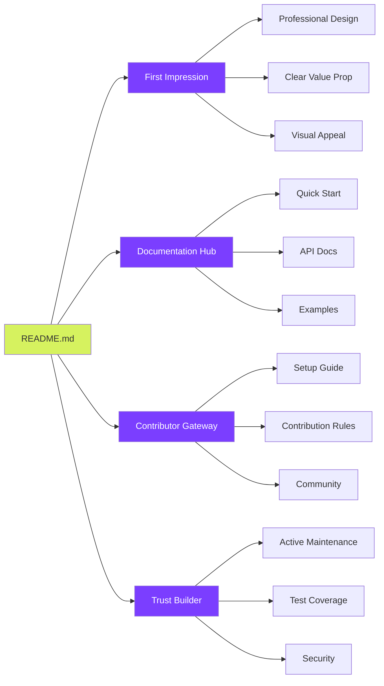

# README.md Planning & Implementation Strategy

## Phase 1: Strategic Planning

### 1.1 Purpose & Objectives

The README.md must serve multiple critical functions:



### 1.2 Target Audiences

| Audience | Needs | README Section Focus |
|----------|-------|---------------------|
| **Potential Users** | Understanding value, features, how to try it | Hero, Features, Demo, Quick Start |
| **Contributors** | Setup, guidelines, architecture, roadmap | Development, Contributing, Architecture |
| **Evaluators** | Technical quality, maintenance, community | Badges, Stats, Tech Stack, Tests |
| **Enterprise** | Security, compliance, support, stability | Security, License, Support |

### 1.3 Content Strategy

**Information Architecture:**
1. **Above the Fold** (Immediate Impact)
   - Hero banner with animated logo
   - Compelling tagline
   - Key badges
   - One-sentence value prop

2. **Discovery Zone** (Why & What)
   - Feature showcase with GIFs
   - Unique differentiators
   - Live demo link

3. **Action Zone** (How to Start)
   - Quick start in 3 steps
   - Installation options
   - First task tutorial

4. **Deep Dive** (Technical Details)
   - Architecture
   - Tech stack
   - Performance metrics

5. **Community** (Join Us)
   - Contributing guide
   - Code of conduct
   - Support channels

### 1.4 Visual Design Plan

```yaml
Visual Elements:
  Banner:
    - Animated SVG logo
    - Gradient background (#D6F25F to #7B3EFF)
    - Tagline with typewriter effect
    
  Badges:
    - Build status (GitHub Actions)
    - Test coverage (Codecov)
    - Version (npm)
    - License (MIT)
    - Contributors count
    - Discord community
    - Security score
    
  Screenshots:
    - Dashboard hero view (animated GIF)
    - Kanban board drag-drop (GIF)
    - Real-time collaboration (GIF)
    - Mobile responsive (static)
    
  Diagrams:
    - Architecture (Mermaid)
    - Data flow (Mermaid)
    - Quick start flow (ASCII art)
    
  Code Samples:
    - Syntax highlighted
    - Copy buttons
    - Multiple languages
```

---

## Phase 2: Implementation Plan

### 2.1 README Structure

```markdown
# README.md Structure

## 1. Hero Section
   - Logo/Banner
   - Badges row
   - Tagline
   - Brief description (2-3 lines)

## 2. Table of Contents
   - Auto-generated with links
   - Emoji icons for sections

## 3. ✨ Features
   - Key features with GIFs
   - Feature comparison table

## 4. 🚀 Quick Start
   - Prerequisites
   - Installation (3 methods)
   - Your first task

## 5. 🎯 Why LimeAura?
   - Problem statement
   - Our solution
   - Differentiators

## 6. 📸 Screenshots
   - Gallery of key views
   - Mobile screenshots

## 7. 🛠️ Tech Stack
   - Frontend technologies
   - Backend technologies
   - Infrastructure

## 8. 🏗️ Architecture
   - High-level diagram
   - Key components
   - Data flow

## 9. 💻 Development
   - Prerequisites
   - Setup steps
   - Common tasks

## 10. 🧪 Testing
   - Running tests
   - Coverage reports
   - E2E testing

## 11. 📦 Deployment
   - Docker instructions
   - Cloud deployment
   - Environment variables

## 12. 🤝 Contributing
   - How to contribute
   - Development workflow
   - Code standards

## 13. 📊 Performance
   - Benchmarks
   - Optimization tips

## 14. 🔒 Security
   - Security features
   - Reporting vulnerabilities

## 15. 📚 Documentation
   - Links to detailed docs
   - API reference
   - Video tutorials

## 16. 🗺️ Roadmap
   - Current phase
   - Upcoming features
   - Long-term vision

## 17. 💬 Community
   - Discord server
   - Discussion forums
   - Social media

## 18. 📄 License
   - License type
   - Commercial use

## 19. 🙏 Acknowledgments
   - Contributors
   - Sponsors
   - Technologies used

## 20. 📞 Support
   - Getting help
   - Commercial support
   - Contact info
```

### 2.2 Content Components

#### Hero Banner Design
```svg
<!-- Animated SVG concept -->
- Gradient background transitioning
- Floating geometric shapes
- Animated LimeAura logo
- Particle effects
- "Productivity Reimagined" tagline with fade-in
```

#### Badge Selection
```markdown


```

#### Feature GIFs Plan
1. **Smart Task Creation** - Natural language input converting to structured task
2. **Real-time Collaboration** - Multiple cursors editing simultaneously
3. **Offline Sync** - Working offline then syncing when connected
4. **AI Predictions** - Smart suggestions appearing as user types
5. **Beautiful Animations** - Card entrance animations on dashboard

### 2.3 Writing Style Guide

```yaml
Tone:
  - Professional yet approachable
  - Enthusiastic but not hyperbolic
  - Technical but accessible
  - Action-oriented

Formatting:
  - Short paragraphs (2-3 sentences max)
  - Bullet points for lists
  - Bold for emphasis
  - Code blocks for commands
  - Tables for comparisons
  - Emojis for visual breaks

Language:
  - Active voice
  - Present tense
  - Second person for instructions
  - Clear CTAs
```

---

## Phase 3: Complete README.md Implementation


---

## Implementation Checklist

### Essential Assets to Create
- [ ] Animated SVG banner (`limeaura-banner-animated.svg`)
- [ ] Feature GIFs (4-6 demonstrations)
- [ ] Screenshots (Dashboard, Kanban, Gantt, Mobile)
- [ ] Architecture diagrams (Mermaid)
- [ ] Logo variations (light/dark)
- [ ] Social media cards

### Documentation to Write
- [ ] CONTRIBUTING.md
- [ ] CODE_OF_CONDUCT.md
- [ ] SECURITY.md
- [ ] CHANGELOG.md
- [ ] Full API documentation
- [ ] Video tutorials (3-5 initial)

### Community Setup
- [ ] Discord server with channels
- [ ] GitHub Discussions categories
- [ ] Issue templates (bug, feature, question)
- [ ] PR template
- [ ] GitHub Actions for automation
- [ ] Sponsor tiers configuration

### Marketing Materials
- [ ] Product Hunt launch assets
- [ ] Social media announcement templates
- [ ] Email newsletter template
- [ ] Blog post drafts
- [ ] Demo video script

This comprehensive README serves as both a technical reference and marketing tool, designed to attract users, contributors, and potential investors. It balances technical depth with accessibility, using visual elements and clear structure to guide readers through the project's value proposition and implementation details.
