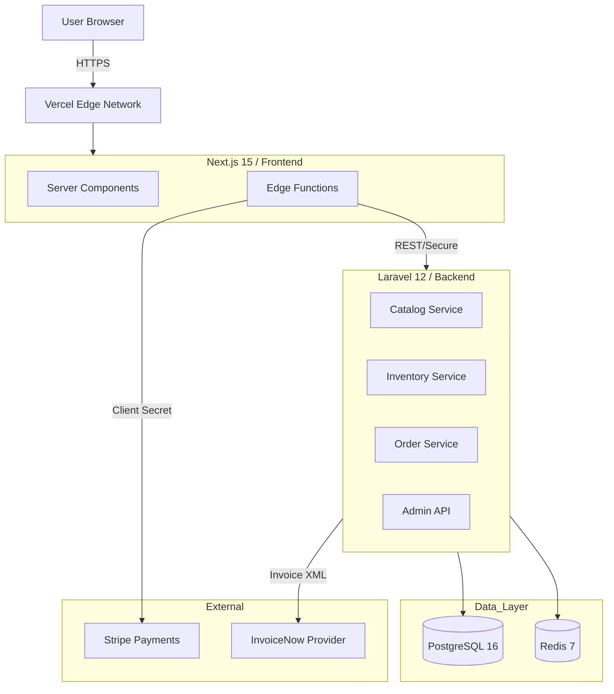

# AGENT.md
```md
# AGENT.md — Developer Briefing & Context Source

> **Status**: ACTIVE / COMPLETE
> **Version**: 1.0.0
> **Date**: January 11, 2026

## 1. Project Identity & Mission

**Merlion Brews** is a Singapore-first, design-led headless commerce platform. It is not a standard e-commerce template. It represents a fusion of **Peranakan Heritage Aesthetic** ("The Soul") and **Enterprise Transactional Integrity** ("The Brain").

**Core Directive**: Never compromise the visual "soul" (defined in `cafe.html`) for technical convenience, and never compromise transactional integrity (GST/Inventory) for speed.

---

## 2. Architectural North Star

The system utilizes a **Hybrid BFF (Backend-for-Frontend)** topology to separate concerns strictly.

### 2.1 Technology Stack (Locked)
*   **Frontend**: Next.js 15 (App Router), TypeScript, Tailwind CSS v4.
*   **Backend**: Laravel 12 (PHP 8.3+), PostgreSQL 16, Redis 7.
*   **Infrastructure**: Docker Compose (Local), Dockerfiles provided for Production (Nginx/FPM).

### 2.2 The "Soul" (Frontend Architecture)
The frontend is the guardian of the design system.
*   **Design Authority**: `cafe.html` is the absolute source of truth for design tokens, animations, and behaviors.
*   **Tailwind v4 Strategy**: We use native CSS cascade layers (`@layer tokens, base, components, utilities, overrides`) defined in `src/app/globals.css`.
*   **Design Token Bridge**: `src/design-tokens/index.ts` mirrors CSS variables for type-safe usage in TypeScript/Framer Motion.
*   **Merlion Wrappers**: We **never** use raw Shadcn primitives for customer-facing UI. We wrap them to enforce the aesthetic:
    *   `Button` -> `ButtonMerlion` (Hover underlay animation).
    *   `Card` -> `CardMerlion` (`folio-frame` double-border effect).
    *   `Sheet` -> `MobileNavMerlion` (Accessible menu).

### 2.3 The "Brain" (Backend Architecture)
The backend is the system of record.
*   **API Strategy**: Versioned REST API (`v1`), secured by Sanctum (Admin) and public/sessionless (Storefront).
*   **Inventory Model**: **Two-Phase Reservation** (`Reserve` -> `Confirm`).
    *   **Logic**: Encapsulated in `InventoryService`.
    *   **Consistency**: Uses `lockForUpdate` to prevent race conditions.
    *   **Audit**: Every stock change is logged in `inventory_ledger`.
*   **Compliance**:
    *   **GST**: 9% tax is calculated backwards from inclusive prices (`GstService`).
    *   **InvoiceNow**: MVP integration via Provider API (`InvoiceNowProviderClient`).
    *   **PayNow**: Supported via Stripe PaymentIntents.

---

## 3. Codebase Map

### Frontend (`/frontend`)
```
src/
├── app/
│   ├── api/                # BFF Proxies (hides backend URL)
│   ├── admin/              # Admin Dashboard (Orders, Inventory)
│   ├── checkout/           # Stripe Elements Page
│   └── page.tsx            # Main Landing Page (Hero, Collections, Story)
├── components/
│   ├── merlion/            # CUSTOM WRAPPERS (The Soul)
│   └── ui/                 # Shadcn Primitives (Do not edit styles here)
├── design-tokens/          # TS definition of cafe.html tokens
└── lib/                    # Stores (Zustand), Utils
```

### Backend (`/backend`)
```
app/
├── Console/Commands/       # Scheduled Jobs (Prune Reservations, Retry Invoices)
├── Http/Controllers/       # API Endpoints (Admin/*, Order, Product, Webhook)
├── Jobs/                   # Async Workers (TransmitInvoiceNowJob)
├── Models/                 # Eloquent Entities (UUIDs used everywhere)
└── Services/               # Domain Logic (Inventory, GST, Stripe, Invoice)
routes/
└── api.php                 # V1 Routes (Throttled & Grouped)
```

---

## 4. Key Workflows & Logic

### 4.1 Checkout & Inventory
1.  **Add to Cart**: Frontend calls BFF -> Backend `POST /reservations`. Backend creates a "soft hold" (TTL 15m) and returns `reservation_id`.
2.  **Checkout Init**: Frontend calls BFF -> Backend `POST /orders/draft`. Backend validates reservation, calculates GST, creates Stripe PaymentIntent.
3.  **Payment**: User pays via Stripe (Card/PayNow).
4.  **Confirmation**: Stripe Webhook -> Backend.
    *   Verifies Signature.
    *   Idempotency Check.
    *   **Hard Commit**: Converts "Reserved" to "Sold" in Inventory.
    *   **Invoice**: Generates Invoice record.

### 4.2 InvoiceNow Transmission
1.  **Trigger**: Invoice creation (post-payment).
2.  **Process**: Dispatches `TransmitInvoiceNowJob`.
3.  **Retry**: Exponential backoff. If stuck > 1hr, `invoices:retry-stuck` command picks it up.

### 4.3 Admin Operations
*   **Auth**: Secure `admin` role (seeded via `AdminSeeder`).
*   **Inventory**: Manual adjustments via Admin UI write to the Ledger for audit trails.

---

## 5. Developer Guide

### 5.1 Running Locally
```bash
# 1. Infrastructure
cd infra && docker compose up -d

# 2. Backend
cd backend
cp .env.example .env
composer install
php artisan migrate --seed # Seeds Products & Admin

# 3. Frontend
cd frontend
cp .env.example .env.local
npm install
npm run dev
```

### 5.2 Testing
*   **Visual Regression**: `cd frontend && npm run test:visual` (Playwright snapshots).
*   **Backend Logic**: `cd backend && php artisan test` (Inventory locks, GST calc).

### 5.3 Troubleshooting
*   **Stripe Webhooks**: If testing locally, use Stripe CLI to forward events to `localhost:8000/api/v1/webhooks/stripe`.
*   **Images**: `cafe.html` assets are SVG data URIs embedded in code. Do not replace with external heavy images without optimization.

---

## 6. Rules of Engagement (Directives)

1.  **Respect the Layer**: When styling, use `@layer components` for complex composite components. Do not pollute the global namespace.
2.  **No Magic Numbers**: Use variables from `design-tokens` (e.g., `text-nyonya-cream`, `font-heading`).
3.  **Strict Compliance**: Do not modify GST calculation logic (`9/109` rule) without verifying IRAS guidelines.
4.  **Database Integrity**: Always use Transactions (`DB::transaction`) when modifying Inventory or Order status.
5.  **Browser Support**: Tailwind v4 features (cascade layers) require modern browsers. Do not polyfill for IE11.

**This document is the Single Source of Truth for the project's architectural intent.**

```

# GEMINI.md
```md
# Merlion Brews — Artisan Coffee Platform

## Project Overview
Merlion Brews is a Singapore-first, design-led headless commerce platform. It fuses a bespoke "Peranakan" aesthetic with enterprise-grade transactional integrity and strict local compliance (GST, InvoiceNow, PayNow).

The system is architected as a **Backend-for-Frontend (BFF)** hybrid:
- **Frontend**: Next.js 15 (App Router) handles the "soul" (UX, animations, design tokens) and orchestrates user flows.
- **Backend**: Laravel 12 acts as the domain authority, handling inventory, orders, compliance, and invoicing.

## Architecture & Technology Stack

**Frontend (`/frontend`)**
- **Framework**: Next.js 15 (App Router)
- **Styling**: Tailwind CSS v4 (CSS-first config via `@theme`)
- **Components**: Shadcn UI primitives wrapped in custom `Merlion` components (e.g., `folio-frame`, `button-merlion`) to enforce the design system.
- **Design Source**: `cafe.html` is the authoritative source for tokens, CSS layers, and interaction behaviors.

**Backend (`/backend`)**
- **Framework**: Laravel 12 (PHP 8.3+)
- **Database**: PostgreSQL 16
- **Cache/Queue**: Redis 7
- **Key Services**: Inventory (Two-Phase Reservation), Orders (GST Logic), Invoicing (InvoiceNow via Provider API).

**Infrastructure (`/infra`)**
- Docker Compose for local development (Postgres + Redis).
- Production Dockerfiles for CI/CD.

## Development Constraints (Scope Lock)

These decisions are **architecturally locked** and must not be drifted from:
1.  **Design Authority**: `cafe.html` is the source of truth.
2.  **Compliance**: 9% GST inclusive pricing, PayNow support via Stripe, and InvoiceNow readiness are mandatory MVP features.
3.  **Stack**: Laravel/Postgres from Day 1 (no serverless backend functions for domain logic).
4.  **Browser Support**: Modern browsers only (Safari 16.4+, Chrome 111+) to support Tailwind v4 native cascade layers.

## Getting Started

### Prerequisites
- Node.js LTS
- PHP 8.3+ & Composer
- Docker Desktop / Compose

### Running Locally
(Refer to `Master_Execution_Plan.md` Phase 1 for detailed setup)
1.  Start infrastructure: `docker compose up -d` (in `/infra`)
2.  Backend: `php artisan serve` (in `/backend`)
3.  Frontend: `npm run dev` (in `/frontend`)

## Execution Plan
The project follows a strict **Master Execution Plan (MEP)** located at `Master_Execution_Plan.md`.
- **Phase 0**: Credentials & Compliance Setup.
- **Phase 1**: Monorepo & Local Infra.
- **Phase 2**: Backend Skeleton.
- **Phase 3**: Design Token Bridge.
- **Phase 4**: Merlion Components.
- **Phase 5**: Storefront Pages.
- **Phase 6**: Cart & Reservations.
- **Phase 7**: Checkout.
- **Phase 8**: Invoicing.
- **Phase 9**: Hardening.
- **Phase 10**: Newsletter.
- **Phase 11**: Events.
- **Phase 12**: Admin.
- **Phase 13**: CI/CD.

**Agent Instructions**: Always check `Master_Execution_Plan.md` before starting a task to ensure alignment with the current phase and validation gates.
```

# Master_Execution_Plan.md
```md
# Master Execution Plan (MEP)
## Merlion Brews — Phase-by-Phase Build Plan for an AI Coding Agent

**Purpose**: This document is a *deterministic*, *phase-gated* execution plan that an AI coding agent can follow to build the complete Merlion Brews codebase with minimal supervision. Each phase is independently executable and ends with objective validation gates. Each file includes:

- **Purpose** (why it exists)
- **Interfaces** (imports/exports, endpoints, env vars, DB tables)
- **Checklist** (must pass before moving forward)

**Scope lock (must not drift)**
- **Frontend**: Next.js 15 (App Router) + Tailwind CSS v4 + Shadcn primitives + Merlion wrapper components
- **Backend**: Laravel 12 (PHP 8.3+) from day 1
- **Database**: PostgreSQL 16 from day 1 (Redis 7 for cache/queues)
- **Payments**: Stripe PaymentIntents with **PayNow required**
- **Compliance**: GST 9% inclusive pricing + invoicing; **InvoiceNow in MVP via provider API**
- **Design authority**: `cafe.html` is the source of truth for tokens, CSS layers, and interaction behaviors
- **Browser floor**: Safari 16.4+, Chrome 111+, Firefox 128+ (Tailwind v4 constraint)

---

## 0. Agent Operating Rules

### 0.1 Global rules
- **Do not change scope**: If a missing requirement is discovered, append as a “Phase X+” enhancement, don’t rewrite prior phases.
- **One phase at a time**: Complete all file checklists for the current phase before starting the next phase.
- **No silent assumptions**: If an interface choice is ambiguous (e.g. Stripe Checkout vs PaymentIntents UI), pick the simplest compliant option and document it in an ADR file in-repo.
- **No “magic”**: Every external dependency must be represented as:
  - env vars
  - config files
  - documented setup steps
- **Validation is mandatory**: each phase defines validations (lint/build/tests) that must pass.

### 0.2 Directory conventions
The repository is a monorepo:
- `frontend/` — Next.js 15 storefront BFF
- `backend/` — Laravel 12 API
- `infra/` — local/dev infra (Docker Compose, scripts)
- `docs/` — ADRs and runbooks

---

## 1. Phase 0 — Critical Compliance & Credentials (Week 0)

### 1.1 Outcome
Long-lead-time credentials for compliance (InvoiceNow, Stripe) are secured or the process is initiated.

### 1.2 Files to create

#### 1) `docs/runbooks/credentials-setup.md`
- **Purpose**: Track status of 3rd party onboarding.
- **Interfaces**:
  - Links to provider portals (IRAS, Stripe, InvoiceNow vendor)
- **Checklist**:
  - [ ] InvoiceNow Provider selected and account created
  - [ ] IRAS Sandbox access requested
  - [ ] Stripe SG account created
  - [ ] Stripe PayNow enabled in dashboard

### 1.3 Phase validations
- Provider credentials (client ID/secret) are available for `.env` usage in later phases.

---

## 2. Phase 1 — Monorepo Foundation + Local Dev Infrastructure

### 1.1 Outcome
A developer can run the full stack locally (Next.js + Laravel + Postgres + Redis) with consistent configuration and a single “happy path” command sequence.

### 1.2 Files to create

#### 0) `.gitignore`
 - **Purpose**: Prevent committing generated, secret, and OS-specific files across the monorepo.
 - **Interfaces**:
   - Covers `frontend/` (Next/Node), `backend/` (Laravel/PHP), `infra/` volumes, `.env` files.
 - **Checklist**:
   - Ignores `.env` files (but not `.env.example`)
   - Ignores `node_modules/`, `.next/`, `vendor/`, `storage/logs/`, `bootstrap/cache/`
   - Ignores IDE files (at minimum `.idea/`, `.vscode/`) and OS artifacts

#### 1) `README.md`
- **Purpose**: Single source for project setup/run instructions.
- **Interfaces**:
  - Commands for local dev
  - Links to `Project_Architecture_Document.md` and `docs/`
- **Checklist**:
  - Includes prerequisites (Node LTS, PHP 8.3, Composer, Docker)
  - Includes step-by-step: start infra, migrate DB, run backend, run frontend
  - Includes env var setup pointers for both apps

#### 2) `infra/docker-compose.yml`
- **Purpose**: Spin up Postgres 16 + Redis 7 for local development.
- **Interfaces**:
  - Exposes Postgres port, Redis port
  - Declares named volumes for persistence
- **Checklist**:
  - Postgres image pinned to major 16
  - Redis image pinned to major 7
  - Health checks enabled for Postgres and Redis
  - No hardcoded secrets (uses env or `.env`)

#### 3) `infra/.env.example`
- **Purpose**: Template env vars for local infra.
- **Interfaces**:
  - POSTGRES_DB / POSTGRES_USER / POSTGRES_PASSWORD
  - REDIS_PORT
- **Checklist**:
  - Contains safe placeholder values
  - Matches `docker-compose.yml`

#### 4) `docs/adr/ADR-0001-scope-lock.md`
- **Purpose**: Prevent scope drift; records the locked decisions.
- **Interfaces**: None (documentation)
- **Checklist**:
  - Lists the locked decisions in the “Scope lock” section above
  - Includes “Do not downgrade Tailwind v4” and “PayNow required”

#### 5) `docs/runbooks/local-development.md`
- **Purpose**: Operational runbook for local environment troubleshooting.
- **Interfaces**:
  - Common errors (ports, migrations, queue)
- **Checklist**:
  - Covers Postgres connectivity checks
  - Covers Redis connectivity checks
  - Covers “reset DB” instructions

### 1.3 Phase validations
- `docker compose up -d` brings up Postgres and Redis healthy
- README steps are executable end-to-end

---

## 3. Phase 2 — Backend Skeleton (Laravel 12) + Core Domain Model

### 2.1 Outcome
Laravel API runs locally, connects to Postgres, supports migrations, and exposes a versioned health endpoint.

### 2.2 Files to create (backend)

#### 0) `backend/` (Laravel scaffold via official tooling)
 - **Purpose**: Create a correct Laravel 12 baseline (framework files, artisan tooling, config defaults).
 - **Interfaces**:
   - Produces `artisan`, `bootstrap/`, `config/`, `public/`, `routes/`, `app/`, etc.
 - **Checklist**:
   - Generated using the official Laravel installer or `composer create-project`
   - `php artisan --version` reports Laravel 12.x
   - `php -v` is PHP 8.3+
   - `config/database.php` is configured (via `.env`) to use PostgreSQL

#### 1) `backend/composer.json`
- **Purpose**: Backend dependency manifest.
- **Interfaces**:
  - PHP >= 8.3
  - Laravel 12
- **Checklist**:
  - Uses Laravel 12
  - Includes required extensions (pdo_pgsql)

#### 2) `backend/.env.example`
- **Purpose**: Backend env template.
- **Interfaces**:
  - DB connection (pgsql)
  - Redis queue/cache
  - Stripe secret/webhook secret
  - InvoiceNow provider credentials
- **Checklist**:
  - No real secrets
  - Includes all required env keys referenced by code

#### 3) `backend/routes/api.php`
- **Purpose**: API routes.
- **Interfaces**:
  - `GET /api/v1/health`
- **Checklist**:
  - Health route returns JSON with version + timestamp
  - Versioned prefix used

#### 4) `backend/app/Http/Controllers/HealthController.php`
- **Purpose**: Health endpoint controller.
- **Interfaces**:
  - Returns JSON
- **Checklist**:
  - Does not query external services
  - Includes app version / git sha if available

#### 5) `backend/database/migrations/xxxx_xx_xx_create_core_tables.php`
- **Purpose**: Create foundational tables (users optional), products, inventory, orders, invoices.
- **Interfaces**:
  - Tables: `products`, `inventory`, `inventory_reservations`, `inventory_ledger`, `orders`, `order_items`, `payments`, `webhook_events`, `invoices`, `invoice_transmissions`
- **Checklist**:
  - All tables created with indexes on lookup keys
  - FK constraints where appropriate
  - Monetary amounts stored as integer cents
  - Ledger tables are append-only by design

#### 6) `backend/app/Models/*` (multiple)
Create at least:
- `Product`, `InventoryItem`, `InventoryReservation`, `InventoryLedgerEntry`, `Order`, `OrderItem`, `Payment`, `WebhookEvent`, `Invoice`, `InvoiceTransmission`
- **Purpose**: Eloquent models for core entities.
- **Interfaces**:
  - Relationships (Order → Items)
  - Attribute casting for JSON fields
- **Checklist**:
  - Model fillable/guarded set correctly
  - Relationships defined and named consistently
  - UUID primary keys (or clearly documented alternative)

### 2.3 Phase validations
- `php artisan migrate` succeeds against Postgres
- `GET /api/v1/health` returns 200

---

## 4. Phase 3 — Design Token Bridge + CSS Layers (Frontend Foundation)

### 3.1 Outcome
Next.js 15 app exists with Tailwind v4 configured in a way that preserves the `cafe.html` layer model and design tokens.

### 3.2 Files to create (frontend)

#### 0) `frontend/` (Next.js scaffold via official tooling)
 - **Purpose**: Create a correct Next.js 15 baseline with App Router.
 - **Interfaces**:
   - Produces `app/`, `next.config.*`, `package.json`, TypeScript config, etc.
 - **Checklist**:
   - Generated using an official Next.js scaffold (`create-next-app`)
   - Next.js is v15.x
   - App Router is enabled (`frontend/app/` exists)
   - `npm run build` succeeds before adding custom features

#### 1) `frontend/package.json`
- **Purpose**: Frontend dependencies.
- **Interfaces**:
  - Next.js 15
  - Tailwind CSS v4
  - Shadcn/Radix deps
- **Checklist**:
  - Includes Next 15
  - Includes Tailwind v4
  - Includes scripts: dev, build, start, lint

#### 2) `frontend/next.config.*`
- **Purpose**: Next config.
- **Interfaces**:
  - Enables App Router
- **Checklist**:
  - Minimal config; no experimental flags unless required

#### 3) `frontend/app/layout.tsx`
- **Purpose**: Root layout; sets fonts and global wrappers.
- **Interfaces**:
  - Imports global CSS
  - Defines metadata
- **Checklist**:
  - Includes `lang="en-SG"`
  - Includes skip link container

#### 4) `frontend/app/globals.css`
- **Purpose**: The authoritative place to implement the CSS layer strategy.
- **Interfaces**:
  - Uses Tailwind v4 `@import "tailwindcss";`
  - Defines `@layer tokens, base, components, utilities, overrides;` (project layers)
  - Defines `@theme { ... }` with token variables
- **Checklist**:
  - Includes tokens from `cafe.html`:
    - colors + rgb variants + ui variants
    - fonts
    - fluid type scale
    - spacing scale
    - durations + easing
    - shadows + z-index
  - Includes reduced motion and contrast media overrides
  - Includes `folio-frame` component styles as in `cafe.html`

#### 5) `frontend/design-tokens/index.ts`
- **Purpose**: Type-safe token mirror used by TS code (e.g. invoices PDF styling, Motion configs).
- **Interfaces**:
  - Exports `designTokens` object
- **Checklist**:
  - Token values match `globals.css` variables
  - Exports typed token keys for IDE safety

#### 6) `frontend/lib/cn.ts`
- **Purpose**: Utility to merge class names.
- **Interfaces**:
  - exports `cn(...classes)`
- **Checklist**:
  - Works with conditional classes

#### 7) `frontend/.env.example`
- **Purpose**: Frontend env template.
- **Interfaces**:
  - `NEXT_PUBLIC_API_BASE_URL` (Laravel base URL)
  - `NEXT_PUBLIC_STRIPE_PUBLISHABLE_KEY`
  - `STRIPE_SECRET_KEY` (server-only for BFF routes)
- **Checklist**:
  - No real secrets
  - Contains every env var referenced by `frontend/app/api/*`

### 3.3 Phase validations
- `npm run build` succeeds
- Visual check: basic page renders using token colors and fonts

---

## 5. Phase 4 — Merlion Component System (Shadcn Primitives + Wrappers)

### 4.1 Outcome
Reusable components replicate the “soul” of `cafe.html` without coupling the entire UI to raw HTML.

### 4.2 Files to create

#### 1) `frontend/components/ui/*` (shadcn primitives)
- **Purpose**: Base primitives.
- **Interfaces**:
  - Exported components used by wrappers
- **Checklist**:
  - Installed consistently via shadcn
  - No bespoke styling in primitives

#### 2) `frontend/components/merlion/button-merlion.tsx`
- **Purpose**: Implements `.btn`, `.btn-primary`, `.btn-secondary` behaviors.
- **Interfaces**:
  - Exports `ButtonMerlion`
  - Props: variant, asChild, etc.
- **Checklist**:
  - Hover underlay animation matches `cafe.html`
  - Focus-visible state is accessible

#### 3) `frontend/components/merlion/card-merlion.tsx`
- **Purpose**: Card wrapper with `folio-frame` support.
- **Interfaces**:
  - Exports `CardMerlion` with props `withFolioFrame?: boolean`
- **Checklist**:
  - `folio-frame` hover lift/shadow matches

#### 4) `frontend/components/merlion/ornament.tsx`
- **Purpose**: Peranakan corner ornaments as reusable component.
- **Interfaces**:
  - Props: position tl/tr/bl/br
- **Checklist**:
  - SVG path/circle details preserved
  - `aria-hidden` used properly

#### 5) `frontend/components/merlion/texture-overlay.tsx`
- **Purpose**: Global paper-fiber overlay.
- **Interfaces**:
  - Used in root layout
- **Checklist**:
  - `pointer-events: none` and correct z-index

#### 6) `frontend/components/merlion/zigzag.tsx`
- **Purpose**: Implements zig-zag editorial layout with RTL flip.
- **Interfaces**:
  - `ZigzagSection` + item props
- **Checklist**:
  - Even children flip using RTL technique

#### 7) `frontend/components/merlion/mobile-nav.tsx`
- **Purpose**: Mobile nav behavior from `cafe.html`.
- **Interfaces**:
  - Manages open state, `aria-expanded`, escape key, focus management
- **Checklist**:
  - Escape closes
  - Focus moves to first link on open
  - Restores focus to trigger on close

### 4.3 Phase validations
- Build passes
- Quick smoke: hero + nav + card + zigzag render without layout shift

---

## 6. Phase 5 — Storefront Pages (Content + Catalog)

### 5.1 Outcome
Pages mirror the structure and voice of `cafe.html` while pulling product data from Laravel.

### 5.2 Files to create

#### 1) `frontend/app/page.tsx`
- **Purpose**: Landing page.
- **Interfaces**:
  - Server Component; calls Laravel catalog endpoints
- **Checklist**:
  - Contains hero content and scroll indicator pattern
  - Uses Merlion wrappers (no raw `.btn` strings unless encapsulated)

#### 2) `frontend/app/api/catalog/route.ts`
- **Purpose**: BFF route handler that fetches catalog from Laravel.
- **Interfaces**:
  - `GET /api/catalog`
- **Checklist**:
  - Implements caching headers suitable for catalog
  - Handles Laravel failures gracefully

#### 3) `backend/routes/api.php` additions
- **Purpose**: Catalog endpoints.
- **Interfaces**:
  - `GET /api/v1/products`
  - `GET /api/v1/products/{slug}`
- **Checklist**:
  - Route names and controller bindings are versioned (`/api/v1/...`)
  - Responses are JSON-only (no HTML)
  - Response includes a stable field set required by UI: `slug`, `name`, `description`, `price_*` (GST-inclusive)

#### 4) `backend/app/Http/Controllers/ProductController.php`
- **Purpose**: Catalog endpoints implementation.
- **Interfaces**:
  - JSON responses
- **Checklist**:
  - Stable response schema
  - Includes fields required by UI (name, slug, description, price)

### 5.3 Phase validations
- Frontend renders products via Laravel
- No direct DB access from Next.js (always via Laravel)

---

## 7. Phase 6 — Cart + Inventory Reservation

### 6.1 Outcome
Add-to-cart creates/updates server-side reservations with TTL; oversell is prevented.

### 6.2 Files to create

#### 1) `backend/routes/api.php` additions
- **Purpose**: Expose inventory reservation endpoints for cart synchronization.
- **Interfaces**:
  - `POST /api/v1/reservations` (create)
  - `PATCH /api/v1/reservations/{id}` (update)
  - `DELETE /api/v1/reservations/{id}` (release)
- **Checklist**:
  - Routes are versioned (`/api/v1/...`)
  - `POST` returns `reservation_id` and `expires_at`
  - `DELETE` is idempotent (safe to call multiple times)

#### 2) `backend/app/Http/Controllers/ReservationController.php`
- **Purpose**: Reservation endpoints.
- **Interfaces**:
  - JSON responses
- **Checklist**:
  - Uses DB transactions
  - Prevents oversell with `stock_count - reserved_count >= qty`
  - Returns `expires_at`

#### 3) `backend/app/Services/InventoryService.php`
- **Purpose**: Encapsulates reservation and confirmation logic.
- **Interfaces**:
  - `reserve(items, ttl)`
  - `confirm(reservationId)`
  - `releaseExpired()`
- **Checklist**:
  - Ledger entries created for each reservation/confirm/release

#### 4) `frontend/lib/cart-store.ts`
- **Purpose**: Client state store (local) that syncs to reservations.
- **Interfaces**:
  - `addItem(sku, qty)`
  - `removeItem(sku)`
  - `syncReservation()`
- **Checklist**:
  - Stores `reservation_id` and `expires_at`
  - Handles expiry gracefully

#### 5) `frontend/app/api/reservations/route.ts`
- **Purpose**: BFF endpoints to call Laravel reservation endpoints.
- **Interfaces**:
  - `POST /api/reservations` (creates/updates reservation via Laravel)
- **Checklist**:
  - Validates payload
  - Returns normalized response for client
  - Does not expose Laravel internal errors verbatim (maps to safe error codes)

### 6.3 Phase validations
- Concurrency test: two users attempting last-item reserve: only one succeeds
- Expired reservations get released via scheduled job

---

## 8. Phase 7 — Checkout + Stripe PaymentIntents (PayNow required)

### 7.1 Outcome
Checkout creates an order draft, initiates Stripe payment with PayNow enabled, and completes via webhook.

### 7.2 Files to create

#### 1) `frontend/app/checkout/page.tsx`
- **Purpose**: Checkout UI.
- **Interfaces**:
  - Calls BFF to create order draft
  - Initiates Stripe payment
- **Checklist**:
  - Displays GST breakdown
  - Offers PayNow
  - Handles 1-hour QR code expiration (refresh logic or timeout message)

#### 2) `frontend/app/api/checkout/route.ts`
- **Purpose**: BFF checkout orchestration.
- **Interfaces**:
  - `POST /api/checkout` (creates order draft via Laravel, creates Stripe PaymentIntent)
- **Checklist**:
  - Uses deterministic idempotency key per reservation/order
  - Stores Stripe IDs in Laravel via API

#### 3) `backend/routes/api.php` additions
- **Purpose**: Expose order draft creation and Stripe intent orchestration endpoints.
- **Interfaces**:
  - `POST /api/v1/orders/draft`
  - `POST /api/v1/payments/stripe/intent`
- **Checklist**:
  - Routes are versioned (`/api/v1/...`)
  - Draft creation is idempotent per `reservation_id`
  - Stripe intent endpoint requires server-side authentication/authorization strategy (even if “public MVP”, document the placeholder)

#### 4) `backend/app/Http/Controllers/OrderController.php`
- **Purpose**: Order draft creation.
- **Interfaces**:
  - JSON responses
- **Checklist**:
  - Stores cents amounts
  - Stores GST rate and breakdown

#### 5) `backend/app/Services/GstService.php`
- **Purpose**: GST calculation.
- **Interfaces**:
  - `calculate(subtotalCents): { subtotal_cents, gst_cents, total_cents, gst_rate }`
- **Checklist**:
  - Uses 9% rate
  - Rounds to nearest cent

#### 6) `backend/app/Http/Controllers/StripeWebhookController.php`
- **Purpose**: Stripe webhook receiver.
- **Interfaces**:
  - `POST /api/v1/webhooks/stripe`
- **Checklist**:
  - Verifies signature using raw request body
  - Idempotency using Stripe event id
  - On success: marks order paid, confirms reservation, creates invoice

#### 7) `backend/app/Services/StripeService.php`
- **Purpose**: Stripe API wrapper.
- **Interfaces**:
  - `createPaymentIntent(order, paymentMethodTypes)`
- **Checklist**:
  - Includes PayNow in payment methods
  - Sets metadata: `order_id`, `reservation_id`

### 7.3 Phase validations
- Test payment flow success via webhook
- Test webhook replay does not double-charge or double-decrement inventory

---

## 9. Phase 8 — Invoicing + InvoiceNow Provider Integration (MVP)

### 8.1 Outcome
Invoices are generated per paid order and transmitted to InvoiceNow via provider API with audit logging and retries.

### 8.2 Files to create

#### 1) `backend/app/Services/InvoiceNumberService.php`
- **Purpose**: Generate unique invoice numbers.
- **Interfaces**:
  - `generate(): string`
- **Checklist**:
  - Unique constraint in DB enforced

#### 2) `backend/app/Services/InvoiceService.php`
- **Purpose**: Build invoice payload.
- **Interfaces**:
  - `createInvoiceForOrder(orderId)`
  - Returns invoice entity
- **Checklist**:
  - Includes Business Registration `2015123456K`
  - Includes GST Registration `M9-1234567-8`
  - Includes GST breakdown

#### 3) `backend/app/Services/InvoiceNowProviderClient.php`
- **Purpose**: HTTP client wrapper for provider API.
- **Interfaces**:
  - `sendInvoice(invoicePayload): ProviderResponse`
- **Checklist**:
  - All credentials from env
  - Handles errors and returns structured error info

#### 4) `backend/app/Jobs/TransmitInvoiceNowJob.php`
- **Purpose**: Async transmission with retries.
- **Interfaces**:
  - Inputs: invoice_id
- **Checklist**:
  - Retries with backoff
  - Writes `invoice_transmissions` rows

#### 5) `backend/app/Console/Kernel.php` additions
- **Purpose**: Schedule reconciliation jobs.
- **Interfaces**:
  - Scheduled commands/jobs for invoice transmission retries and reservation cleanup
- **Checklist**:
  - Schedules “retry stuck transmissions”

### 8.3 Phase validations
- Paid order triggers invoice creation
- Transmission attempt logged
- Retry mechanism works on simulated failures

---

## 10. Phase 9 — Observability, Security Hardening, and Quality Gates

### 9.1 Outcome
The system is production-ready enough to deploy with monitoring hooks and clear runbooks.

### 9.2 Files to create

#### 1) `docs/runbooks/production-operations.md`
- **Purpose**: Incident and operational guidance.
- **Interfaces**:
  - Procedures covering:
    - Stripe webhook intake and idempotency failures
    - Inventory reservation expiry and reconciliation
    - InvoiceNow transmission retries and stuck states
- **Checklist**:
  - Covers webhook failures, invoice failures, reservation release

#### 2) `backend/app/Http/Middleware/RateLimitMiddleware.php` (or framework rate limiting config)
- **Purpose**: Rate limit checkout/webhooks.
- **Interfaces**:
  - Applied to endpoints:
    - `POST /api/v1/webhooks/stripe`
    - `POST /api/v1/orders/draft`
    - `POST /api/v1/reservations`
- **Checklist**:
  - Sensible defaults, documented

#### 3) `frontend/tests/visual/*` (Playwright)
- **Purpose**: Visual regression for design fidelity.
- **Interfaces**:
  - CI runnable via `npm run test:visual` (script must exist when implemented)
- **Checklist**:
  - Snapshot hero, folio-frame hover, ornaments, zigzag

#### 4) `backend/tests/Feature/*`
- **Purpose**: Feature tests for critical flows.
- **Interfaces**:
  - PHPUnit tests validating API endpoints and service behaviors
- **Checklist**:
  - Inventory oversell prevention
  - Webhook idempotency
  - GST correctness

### 9.3 Phase validations
- CI-style command set passes (lint + tests)

---

## 11. Phase 10 — Newsletter, Consent, and Transactional Messaging

### 10.1 Outcome
Newsletter signup is implemented end-to-end with explicit consent capture (PDPA-aligned), and the system can send transactional emails (order confirmation, invoice delivery) via a pluggable mail provider.

### 10.2 Files to create

#### 1) `backend/routes/api.php` additions
- **Purpose**: Expose newsletter subscription and consent endpoints.
- **Interfaces**:
  - `POST /api/v1/newsletter/subscribe`
- **Checklist**:
  - Payload includes `email` and `consent_marketing: true`
  - Stores consent timestamp and source

#### 2) `backend/app/Http/Controllers/NewsletterController.php`
- **Purpose**: Newsletter subscribe endpoint.
- **Interfaces**:
  - Request validation: `email`, `consent_marketing`
  - Response: `{ status }` and a stable message
- **Checklist**:
  - Rejects requests without explicit consent
  - Idempotent by email (multiple submits safe)

#### 3) `backend/database/migrations/xxxx_xx_xx_create_newsletter_tables.php`
- **Purpose**: Store subscribers and consent.
- **Interfaces**:
  - Tables: `newsletter_subscribers`
- **Checklist**:
  - Unique index on `email`
  - Stores `consent_granted_at`, `consent_source`, `unsubscribed_at`

#### 4) `backend/app/Services/MailService.php`
- **Purpose**: Central wrapper for sending email.
- **Interfaces**:
  - `send(to, template, data)`
- **Checklist**:
  - Uses Laravel mail configuration (no direct provider SDK calls in controllers)
  - Logs failures for reconciliation

#### 5) `frontend/components/merlion/newsletter-form.tsx`
- **Purpose**: Newsletter form matching `cafe.html` tone and hierarchy.
- **Interfaces**:
  - Calls `POST /api/newsletter/subscribe` (BFF)
- **Checklist**:
  - Includes explicit consent checkbox (unchecked by default)
  - Accessible labels and error states

#### 6) `frontend/app/api/newsletter/route.ts`
- **Purpose**: BFF route to call Laravel newsletter endpoint.
- **Interfaces**:
  - `POST /api/newsletter/subscribe`
- **Checklist**:
  - Validates payload server-side
  - Maps Laravel validation errors to safe client errors

### 10.3 Phase validations
- Newsletter signup succeeds with consent and fails without consent
- Transactional email sending works in dev (log driver / sandbox)

---

## 12. Phase 11 — Experiences & Events Booking (Tasting Room + Cultural Gatherings)

### 11.1 Outcome
Users can book experiences and reserve event spots (as implied by `cafe.html`), with capacity management and optional payment requirements.

### 11.2 Files to create

#### 1) `backend/database/migrations/xxxx_xx_xx_create_events_and_bookings.php`
- **Purpose**: Store events/experiences and reservations.
- **Interfaces**:
  - Tables: `experiences`, `events`, `event_sessions`, `bookings`
- **Checklist**:
  - Capacity fields and indexes
  - Booking state machine field (`status`: pending/confirmed/cancelled)

#### 2) `backend/app/Services/CapacityService.php`
- **Purpose**: Prevent overbooking.
- **Interfaces**:
  - `reserveSpot(sessionId, qty)`
  - `confirmBooking(bookingId)`
  - `cancelBooking(bookingId)`
- **Checklist**:
  - Uses transactions
  - Prevents oversell under concurrency

#### 3) `backend/routes/api.php` additions
- **Purpose**: Booking APIs.
- **Interfaces**:
  - `GET /api/v1/events`
  - `POST /api/v1/bookings`
  - `POST /api/v1/bookings/{id}/cancel`
- **Checklist**:
  - All endpoints versioned
  - Cancel is idempotent

#### 4) `frontend/app/events/page.tsx`
- **Purpose**: Events listing page.
- **Interfaces**:
  - Fetches events via BFF or direct server fetch to Laravel
- **Checklist**:
  - Uses Merlion components
  - Preserves `cafe.html` narrative hierarchy

#### 5) `frontend/app/api/bookings/route.ts`
- **Purpose**: BFF booking creation.
- **Interfaces**:
  - `POST /api/bookings`
- **Checklist**:
  - Validates payload
  - Provides user-friendly errors for sold-out sessions

### 11.3 Phase validations
- Two users racing for last seat: only one booking succeeds
- Book/cancel flows work end-to-end

---

## 13. Phase 12 — Admin Dashboard (Day‑1 Operations)

### 12.1 Outcome
Admin users can manage products, inventory adjustments, orders, invoices, bookings, and operational states (webhook/invoice transmission statuses).

### 12.2 Files to create

#### 1) `backend/database/migrations/xxxx_xx_xx_create_admin_roles.php`
- **Purpose**: Admin RBAC.
- **Interfaces**:
  - Tables for roles/permissions (implementation choice must be documented)
- **Checklist**:
  - Includes an initial `admin` role
  - Seed mechanism documented (seeders or artisan command)

#### 2) `backend/routes/api.php` additions
- **Purpose**: Admin endpoints.
- **Interfaces**:
  - `GET /api/v1/admin/orders`
  - `PATCH /api/v1/admin/inventory/{sku}`
  - `GET /api/v1/admin/invoices/{id}`
- **Checklist**:
  - Protected by auth middleware
  - Inventory adjustments always write to ledger

#### 3) `frontend/app/admin/layout.tsx`
- **Purpose**: Admin layout shell.
- **Interfaces**:
  - Uses shared tokens and Merlion wrapper styles
- **Checklist**:
  - Clear navigation
  - Accessible, responsive layout

#### 4) `frontend/app/admin/orders/page.tsx`
- **Purpose**: Admin order list.
- **Interfaces**:
  - Fetches `GET /api/v1/admin/orders`
- **Checklist**:
  - Shows paid/unpaid states and invoice transmission status

### 12.3 Phase validations
- Admin can adjust inventory and ledger is written
- Admin can view invoice transmission attempts

---

## 14. Phase 13 — CI, Deployment, and Environment Promotion

### 13.1 Outcome
The repository can be built and tested automatically, and deployed to production-like environments with clear promotion steps.

### 13.2 Files to create

#### 1) `docs/runbooks/deployment.md`
- **Purpose**: Deployment instructions.
- **Interfaces**:
  - Describes deployment targets for frontend and backend
- **Checklist**:
  - Includes environment variables list
  - Includes rollback strategy

#### 2) `infra/production/*` (provider-specific)
- **Purpose**: Deployment manifests.
- **Interfaces**:
  - Backend container build/run notes
  - Frontend deploy notes
- **Checklist**:
  - No secrets committed
  - Uses env-based configuration

### 13.3 Phase validations
- CI pipeline runs build + tests
- Deploy runbook is complete and reproducible

---

## 15. Global Interfaces Contract (must remain stable)

### 14.1 Backend API (minimum contract)
- `GET /api/v1/health`
- `GET /api/v1/products`
- `GET /api/v1/products/{slug}`
- `POST /api/v1/reservations`
- `PATCH /api/v1/reservations/{id}`
- `DELETE /api/v1/reservations/{id}`
- `POST /api/v1/orders/draft`
- `POST /api/v1/webhooks/stripe`

- `POST /api/v1/newsletter/subscribe`

- `GET /api/v1/events`
- `POST /api/v1/bookings`
- `POST /api/v1/bookings/{id}/cancel`

- `GET /api/v1/admin/orders`
- `PATCH /api/v1/admin/inventory/{sku}`
- `GET /api/v1/admin/invoices/{id}`

### 14.2 Frontend BFF routes (minimum contract)
- `GET /api/catalog`
- `POST /api/reservations`
- `POST /api/checkout`

- `POST /api/newsletter/subscribe`
- `POST /api/bookings`

---

## 16. Final Review Checklist for This MEP (self-validation)
The AI coding agent (or reviewer) must confirm:
- Every phase has:
  - Outcome
  - File list
  - Per-file purpose/interfaces/checklist
  - Phase validations
- Requirements are explicitly encoded:
  - Tailwind v4
  - Laravel/Postgres day 1
  - PayNow required
  - InvoiceNow via provider
  - `cafe.html` design authority
- No phase depends on undocumented prior work

---

## 17. Notes for Minimal-Supervision Execution
- If a phase introduces new env vars, **update `.env.example` files** in that same phase.
- If a response schema changes, create an ADR in `docs/adr/`.
- Keep the UI “soul” safe by ensuring `globals.css` and wrapper components match `cafe.html` before adding more product features.

```

# Project_Architecture_Document.md
```md
# Project Architecture Document (PAD)
## Merlion Brews — Artisan Coffee Crafted with Peranakan Soul

**Document Status**: Finalized
**Date**: January 11, 2026
**Version**: 2.0 (Authoritative)

---

## 1. Executive Summary
Merlion Brews is a Singapore-first, design-led headless commerce platform that preserves the bespoke Peranakan aesthetic defined in `cafe.html` while providing enterprise-grade transactional integrity and compliance. The system uses **Next.js 15 (App Router)** as a storefront **BFF** and rendering layer, **Laravel 12 (PHP 8.3+)** as the day‑1 domain API, **PostgreSQL 16** as the system of record with **two-phase inventory reservation + ledger auditing**, and **Stripe** as the payment processor with **PayNow** enabled via PaymentIntents. GST (9%) is treated as a first-class requirement across pricing display, order totals, and invoicing. For e‑invoicing, **InvoiceNow is in-scope for MVP** and will be implemented via an **InvoiceNow-ready provider API**, with auditability, retry, and reconciliation built in. This ensures readiness for the **April 1, 2026** mandate for new voluntary GST registrants.

---

## 2. Goals, Non-goals, and Assumptions

### 2.1 Goals
- **Aesthetic Fidelity First**: Preserve the **design system and interaction behaviors** encoded in `cafe.html` as architectural constraints.
  - CSS layer architecture (`@layer tokens, base, components, utilities, overrides`).
  - Tokenized Peranakan palette with accessibility variants.
  - Signature components: `folio-frame` (double-border + gold inset), Peranakan ornaments (SVG paths), zig-zag editorial layouts (`direction: rtl`).
  - "Emotional Performance": Micro-interactions (floating beans, scroll reveal) must trigger perceived value, not just load speed.
- **Commerce Integrity**: Ship an MVP with:
  - Full commerce: browse products, cart, checkout, receipt/invoice.
  - **Stripe + PayNow** (Required).
  - Inventory oversell prevention via **Two-Phase Reservation**.
- **Compliance Hardening**:
  - GST-inclusive display and compliant invoice data (9% rate).
  - InvoiceNow transmission via provider API (MVP).
  - PDPA consent controls.

### 2.2 Non-goals (MVP)
- Multi-warehouse fulfillment and advanced OMS.
- Custom payment processing outside Stripe.
- Multi-currency pricing beyond SGD.
- Full event-sourcing infrastructure (we use a ledger for auditability instead).

### 2.3 Assumptions & Constraints
- **Browser Floor**: Tailwind CSS v4 targets modern browsers (Safari 16.4+, Chrome 111+, Firefox 128+). We explicitly accept this to leverage native cascade layers and `@property`.
- **Backend Day-1**: We accept the operational overhead of Laravel/Postgres from the start to ensure compliance (InvoiceNow) and integrity (Inventory) are robust, rather than refactoring from serverless later.

---

## 3. Source-of-Truth Map (Authoritative Inputs)

### 3.1 UI / Design System / Interaction Authority
**Authoritative Artifact**: `cafe.html`

The following are **non-negotiable requirements**:
- **CSS Architecture**: `@layer tokens, base, components, utilities, overrides` must be preserved.
- **Typography**: Cormorant Garamond (Headings), Crimson Pro (Body), Pinyon Script (Accents).
- **Colors**: Nyonya Cream (`#F8F3E6`), Kopi Brown (`#3A2A1F`), Terracotta (`#C77966`), Heritage Blue (`#4A6B7D`), Gold Leaf (`#D4AF37`).
- **Behaviors**: 
  - Mobile nav with `aria-expanded` and focus trapping.
  - Floating coffee bean animation (`float` keyframe).
  - Texture overlay (fixed position, pointer-events-none).

### 3.2 Architecture & Domain Authority
**Authoritative Artifacts**: `cafe_PAD_q.md` and `cafe_PAD_d.md` (Reconciled)

- **Topology**: Next.js (BFF) + Laravel (Domain).
- **Inventory**: Two-phase reservation (Reserve -> Commit) + Ledger.
- **Payments**: Stripe PaymentIntents with PayNow + Webhook Signature Verification.

### 3.3 Business Registration + GST IDs
**Authoritative Artifact**: `cafe.html`

- Business Registration: **2015123456K**
- GST Registration: **M9-1234567-8**

---

## 4. Architecture Decision Records (ADRs)

### ADR-001 — Next.js as BFF (Committed)
- **Decision**: Next.js 15 App Router acts as storefront renderer and BFF.
- **Rationale**: Server Components for fast TTFB on marketing pages; Edge Functions for low-latency cart/checkout orchestration; strict separation of concerns from the Domain API.

### ADR-002 — Laravel + Postgres Day‑1 (Committed)
- **Decision**: Laravel 12 and Postgres 16 are implemented immediately.
- **Rationale**: Compliance requirements (InvoiceNow, GST audit trails) and Transactional Integrity (Inventory locking) are too complex to defer. We trade initial velocity for architectural stability.

### ADR-003 — Tailwind CSS v4 (Committed)
- **Decision**: Use Tailwind CSS v4.
- **Rationale**: Native support for `@layer` aligns perfectly with `cafe.html`'s architecture. CSS-first configuration (`@theme`) simplifies the Design Token Bridge.

### ADR-004 — Inventory Integrity via Two-Phase Reservation (Committed)
- **Decision**: Implement `reserve` (TTL-based) and `commit` (Payment-confirmed) phases, backed by an immutable ledger.
- **Rationale**: Prevents overselling during high-traffic drops; resolves race conditions better than simple atomic decrements.

### ADR-005 — InvoiceNow MVP via Provider API (Committed)
- **Decision**: Integrate with an InvoiceNow-ready provider’s API.
- **Rationale**: Direct Peppol access point implementation is out of scope for MVP. Provider API ensures compliance with minimal engineering overhead.

---

## 5. High-Level System Architecture

### 5.1 Container Diagram
```mermaid
graph TD
  User[User Browser] -->|HTTPS| Edge[Vercel Edge Network]
  
  subgraph Frontend_BFF [Next.js 15 App Router]
    Page[Server Components\nMarketing/Content]
    Cart[Edge Functions\nCart/Checkout Orchestration]
  end
  
  Edge --> Frontend_BFF
  
  subgraph Backend_Domain [Laravel 12 API]
    Catalog[Catalog Service]
    Inventory[Inventory Service]
    Order[Order Service]
    Invoice[InvoiceNow Service]
  end
  
  Cart -->|REST/Secure| Backend_Domain
  
  subgraph Data_Layer
    PG[(PostgreSQL 16)]
    Redis[(Redis 7)]
  end
  
  Backend_Domain --> PG
  Backend_Domain --> Redis
  
  subgraph External
    Stripe[Stripe Payments]
    IRAS[InvoiceNow Provider]
  end
  
  Cart -->|Client Secret| Stripe
  Stripe -->|Webhook (Signed)| Backend_Domain
  Backend_Domain -->|Invoice XML| IRAS
```

### 5.2 Responsibilities
- **Next.js (BFF)**: 
  - Host the Design System (`@layer` architecture).
  - Orchestrate the "Emotional" experience (animations, transitions).
  - Manage ephemeral cart state.
- **Laravel (Domain)**:
  - Authoritative Product Catalog.
  - Inventory Ledger & Reservation logic.
  - Order Lifecycle & GST Calculation.
  - Webhook verification & Idempotency.
  - InvoiceNow transmission.

---

## 6. Frontend Architecture (Next.js 15)

### 6.1 Rendering & Caching
- **Marketing Pages (Home, Story)**: Static Generation (SSG) with ISR (revalidate: 3600).
- **Product Pages**: ISR (revalidate: 60) + Client Components for "Add to Cart".
- **Cart/Checkout**: Client Components interacting with Edge Functions.

### 6.2 Design Token Bridge (The "Soul" Pipeline)
To ensure strict adherence to `cafe.html`:
1.  **Extraction**: Tokens from `cafe.html` (colors, fonts, spacing) are extracted into a TypeScript source of truth (`design-tokens.ts`).
2.  **Generation**: A build script converts TS tokens into a Tailwind v4 CSS theme configuration (`@theme`).
3.  **Consumption**: Components use Tailwind utilities that reference these semantic tokens (e.g., `text-nyonya-cream`, `animate-float`).

---

## 7. Component Architecture: "Merlion Wrappers"

### 7.1 Philosophy
**"Shadcn Primitives provide discipline. Merlion Wrappers provide soul."**
We do **not** use raw Shadcn components in page layouts. We use **Merlion Wrappers**.

### 7.2 Core Wrappers (Must Implement)
- **`CardMerlion`**: Extends Shadcn Card. Adds `.folio-frame` behavior (double border, gold inset, hover lift).
- **`ButtonMerlion`**: Extends Shadcn Button. Implements the specific hover underlay animation from `cafe.html`.
- **`MerlionImage`**: Next.js Image wrapper that applies the `folio-frame` and specific aspect ratios.
- **`ZigzagSection`**: Layout component implementing the `direction: rtl` / `direction: ltr` flipping logic for editorial flow.
- **`OrnamentSystem`**: SVG component handling the `peranakan-corner` paths, capable of positioning (TL, TR, BL, BR) and reduced-motion compliance.
- **`TextureOverlay`**: Global fixed component rendering the paper fiber noise.

---

## 8. Backend Architecture (Laravel 12)

### 8.1 Domain Services
- **Catalog**: Read-heavy. Cached in Redis.
- **Inventory**: Write-critical. Handles `reserve(sku, qty, ttl)` and `commit(reservation_id)`.
- **Order**: Handles GST calculation (9% inclusive extraction) and Order state machine.
- **Invoice**: Generates UBL/Peppol compliant XML payloads for the provider API.

### 8.2 Queueing & Jobs
- `ProcessStripeWebhook`: High priority. Verifies signature, checks idempotency, commits inventory.
- `PruneExpiredReservations`: Scheduled (every 5 mins). Releases stock from expired reservations.
- `TransmitInvoiceNow`: Retryable job with exponential backoff for IRAS transmission.

---

## 9. Data Architecture (PostgreSQL 16)

### 9.1 Schema: Inventory (Reservation + Ledger)
```sql
CREATE TABLE inventory (
  sku VARCHAR(50) PRIMARY KEY,
  stock_count INTEGER NOT NULL DEFAULT 0,
  reserved_count INTEGER NOT NULL DEFAULT 0
);

CREATE TABLE inventory_reservations (
  id UUID PRIMARY KEY,
  sku VARCHAR(50) REFERENCES inventory(sku),
  quantity INTEGER NOT NULL,
  expires_at TIMESTAMP NOT NULL,
  status VARCHAR(20) DEFAULT 'active' -- active, committed, expired
);

CREATE TABLE inventory_ledger (
  id UUID PRIMARY KEY,
  sku VARCHAR(50),
  quantity_change INTEGER,
  reason VARCHAR(50), -- reservation, commit, release, adjustment
  reference_id UUID,
  created_at TIMESTAMP DEFAULT NOW()
);
```

### 9.2 Schema: Orders & GST
- `orders` table **must** store:
  - `subtotal_cents`: integer
  - `gst_cents`: integer (explicitly calculated)
  - `total_cents`: integer
  - `gst_rate`: decimal (9.00)
  - `invoice_number`: string (unique, e.g., MB-2026-XXXX)

---

## 10. Checkout, Payments, and PayNow

### 10.1 Flow
1.  **Cart**: User clicks checkout. Next.js requests `PaymentIntent` from Laravel.
2.  **Laravel**: 
    - Creates `Order` (pending).
    - Extends `Reservation` TTL.
    - Calls Stripe API (`payment_method_types: ['card', 'paynow']`).
    - Returns `client_secret`.
3.  **Frontend**: Renders Stripe Payment Element (supporting PayNow QR). **Note**: QR code is valid for 1 hour; UI must handle expiration.
4.  **Webhook**: Stripe hits Laravel (`checkout.session.completed` or `payment_intent.succeeded`).
5.  **Reconciliation**: Laravel verifies signature -> Commits Reservation -> Generates Invoice -> Queues InvoiceNow transmission.

---

## 11. Compliance (GST, PDPA, InvoiceNow)

### 11.1 GST
- **Display**: "Prices include 9% GST".
- **Calculation**: Tax fraction = 9/109 of the gross price.
- **Invoice**: Must strictly follow IRAS tax invoice requirements.

### 11.2 InvoiceNow (MVP)
- **Strategy**: Provider API.
- **Requirement**: We must log the `transmission_id` and `status` returned by the provider for every invoice.

---

## 12. Performance & "Emotional Performance"

### 12.1 Tiered Budgets
- **Tier 1 (Critical)**: LCP < 2.5s. Text, Structure, Main Image.
- **Tier 2 (Interactive)**: FID < 100ms. Nav, Buttons.
- **Tier 3 (Emotional)**: Floating beans, texture overlay, scroll reveal. Loaded immediately but CSS-animated (GPU efficient).
- **Tier 4 (Ambient)**: Complex SVG paths. Lazy loaded if below fold.

### 12.2 Tailwind v4 Optimization
- Use `@theme` to inline tokens.
- Use native CSS layers to ensure "Overrides" (`@layer overrides`) always win over "Utilities".

---

## 13. Delivery Plan (MVP)

### Phase 0: Critical Compliance Setup (Week 0)
*Goal: Secure long-lead-time credentials.*
- **Deliverables**:
  - Select and contract InvoiceNow-ready provider.
  - Register for IRAS InvoiceNow sandbox.
  - Obtain Stripe Singapore credentials.

### Phase 1: The Design Foundation (Frontend Only)
*Goal: Perfect aesthetic fidelity before backend integration.*
- **Deliverables**: 
  - Next.js repo setup with Tailwind v4.
  - `design-tokens.ts` bridge implemented.
  - `Merlion` wrapper components built & visually tested against `cafe.html`.
  - Static pages (Home, Story) ported.
- **Gate**: Visual Regression Test (Percy/Snapshot) vs `cafe.html`.

### Phase 2: The Transactional Core (Backend)
*Goal: Inventory and Payment integrity.*
- **Deliverables**:
  - Laravel 12 setup + Postgres.
  - Inventory Services (Reservation/Ledger) implemented.
  - Stripe integration (PayNow/Webhooks).
  - GST Logic & Invoice Generation.

### Phase 3: Integration & Compliance
*Goal: Connecting the Brain to the Soul.*
- **Deliverables**:
  - Connect Next.js Cart to Laravel API.
  - Implement InvoiceNow provider integration.
  - End-to-end Checkout tests (PayNow flow).

### Phase 4: Hardening
- **Deliverables**:
  - Load testing (Inventory locking).
  - PDPA Consent banners.
  - Production Deployment (Vercel + AWS/DigitalOcean).

---

## 14. Validation Gates (Checklist)

### Pre-Code
- [ ] Tailwind v4 browser targets confirmed accepted.
- [ ] InvoiceNow provider selected and API keys obtained.

### Pre-Launch
- [ ] **Aesthetic**: `folio-frame` matches `cafe.html` double-border pixel-perfectly.
- [ ] **Interaction**: Mobile menu traps focus and supports ESC to close.
- [ ] **Inventory**: Concurrent checkout test (10 users, 1 item) results in 1 success, 9 failures (no oversell).
- [ ] **Payments**: Stripe Webhook signature verification is active and blocking unsigned requests.
- [ ] **GST**: Invoices generated show exactly 9% tax breakdown.
- [ ] **Performance**: LCP < 2.5s with "Floating Beans" enabled.

---

## Appendix A: Data Models
*Refer to Section 9 for Schema Definitions.*

## Appendix B: Key `cafe.html` Assets
*Floating Bean Animation*:
```css
@keyframes float {
    0%, 100% { transform: translateY(0) rotate(0deg); opacity: 0.3; }
    50% { transform: translateY(-20px) rotate(15deg); opacity: 0.6; }
}
```
*Folio Frame Styles*:
```css
.folio-frame {
    border: 1px solid rgba(var(--color-kopi-brown-rgb), 0.1);
}
.folio-frame::after {
    border: 1px solid rgba(var(--color-gold-leaf-rgb), 0.2);
    /* inset 8px */
}
```
```

# README.md
```md


# Merlion Brews ☕️🇸🇬
### Artisan Coffee Crafted with Peranakan Soul & Enterprise Integrity


---

## 📖 The Vision

**Merlion Brews** is a Singapore-first, design-led headless commerce platform. It rejects the "template aesthetic" of modern e-commerce in favor of a bespoke **Peranakan Design System** defined in `cafe.html`, while enforcing rigorous enterprise standards for transactional integrity and local compliance.

We are building a bridge between **Heritage** (Aesthetic Fidelity) and **Scale** (Commerce Integrity).

## ✨ Key Features

### 🎨 Design System ("The Soul")
*   **Authoritative Source**: `cafe.html` dictates all tokens, layers, and behaviors.
*   **Merlion Wrappers**: Custom components (e.g., `folio-frame`, `button-merlion`) wrapping Shadcn primitives to enforce the double-border gold-inset aesthetic.
*   **Emotional Performance**: Micro-interactions (floating beans, scroll reveals) treated as first-class citizens alongside Core Web Vitals.
*   **Tailwind v4**: Utilizing native CSS cascade layers (`@layer tokens, base...`) and CSS-first configuration.

### 💼 Commerce Engine ("The Brain")
*   **Next.js 15 BFF**: A Backend-for-Frontend layer handling UX orchestration and edge caching.
*   **Laravel 12 Domain API**: System-of-record for products, orders, and inventory.
*   **Two-Phase Inventory**: Reservation (TTL-based) → Commitment (Payment-confirmed) with ledger auditing to prevent overselling.

### 🇸🇬 Singapore Compliance ("The Law")
*   **GST Hardening**: 9% GST calculated and displayed explicitly on all line items.
*   **PayNow Support**: Integrated via Stripe PaymentIntents for local seamless payment.
*   **InvoiceNow**: MVP-scope integration via provider API for PEPPOL network compliance (April 1, 2026 mandate ready).
*   **PDPA**: Explicit consent tracking for marketing communications.

---

## 🏗 Architecture

Merlion Brews follows a **Hybrid BFF** topology:



---

## 🚀 Quick Start

### Prerequisites
*   **Docker Desktop** (for Postgres/Redis)
*   **Node.js LTS** (v20+)
*   **PHP 8.3+** & **Composer**

### Installation

1.  **Clone the Monorepo**
    ```bash
    git clone https://github.com/your-org/merlion-brews.git
    cd merlion-brews
    ```

2.  **Start Infrastructure**
    ```bash
    cd infra
    cp .env.example .env
    docker compose up -d
    ```

3.  **Setup Backend (Laravel)**
    ```bash
    cd ../backend
    cp .env.example .env
    composer install
    php artisan key:generate
    php artisan migrate --seed
    php artisan serve
    ```

4.  **Setup Frontend (Next.js)**
    ```bash
    cd ../frontend
    cp .env.example .env.local
    npm install
    npm run dev
    ```

Visit the storefront at `http://localhost:3000` and the API at `http://localhost:8000`.

---

## 📂 Project Structure

```
merlion-brews/
├── backend/                # Laravel 12 Domain API
│   ├── app/Services/       # Inventory, Gst, InvoiceNow logic
│   └── routes/api.php      # Versioned API endpoints
├── frontend/               # Next.js 15 Storefront
│   ├── app/                # App Router (Server Components)
│   ├── components/merlion/ # Aesthetic Wrappers (The Soul)
│   └── design-tokens/      # TypeScript Token Bridge
├── infra/                  # Docker Compose & Local Env
│   └── production/         # Production Dockerfiles
└── docs/                   # Architecture & Runbooks
    ├── ADR/                # Architecture Decision Records
    └── runbooks/           # Operational Guides
```

---

## 🛠 Development Workflow

We follow a **Meticulous Approach** driven by the `Master_Execution_Plan.md` (MEP).

1.  **Phase-Gated Execution**: We do not proceed to a new phase until all validation gates of the current phase are met.
2.  **Scope Lock**: 
    *   No drifting from `cafe.html` aesthetic.
    *   No dropping InvoiceNow/PayNow requirements.
3.  **Agent-Friendly**: The MEP is designed to be executed by AI coding agents with minimal supervision, provided the context is respected.

---

## 🗺 Roadmap

- [x] **Phase 0**: Credentials (InvoiceNow/Stripe)
- [x] **Phase 1**: Monorepo & Local Infra
- [x] **Phase 2**: Backend Skeleton & Domain Models
- [x] **Phase 3**: Design Token Bridge & CSS Layers
- [x] **Phase 4**: Merlion Component Wrappers
- [x] **Phase 5**: Storefront Pages
- [x] **Phase 6**: Cart & Inventory Reservation
- [x] **Phase 7**: Checkout (Stripe + PayNow)
- [x] **Phase 8**: Invoicing (GST + InvoiceNow)
- [x] **Phase 9**: Hardening & Observability
- [x] **Phase 10**: Newsletter & Consent
- [x] **Phase 11**: Events Booking
- [x] **Phase 12**: Admin Dashboard
- [x] **Phase 13**: CI/CD & Deployment

---

## 📄 License

MIT License

Copyright (c) 2026 Merlion Brews Artisan Roastery Pte. Ltd. Singapore

Permission is hereby granted, free of charge, to any person obtaining a copy
of this software and associated documentation files (the "Software"), to deal
in the Software without restriction, including without limitation the rights
to use, copy, modify, merge, publish, distribute, sublicense, and/or sell
copies of the Software, and to permit persons to whom the Software is
furnished to do so, subject to the following conditions:

The above copyright notice and this permission notice shall be included in all
copies or substantial portions of the Software.

THE SOFTWARE IS PROVIDED "AS IS", WITHOUT WARRANTY OF ANY KIND, EXPRESS OR
IMPLIED, INCLUDING BUT NOT LIMITED TO THE WARRANTIES OF MERCHANTABILITY,
FITNESS FOR A PARTICULAR PURPOSE AND NONINFRINGEMENT. IN NO EVENT SHALL THE
AUTHORS OR COPYRIGHT HOLDERS BE LIABLE FOR ANY CLAIM, DAMAGES OR OTHER
LIABILITY, WHETHER IN AN ACTION OF CONTRACT, TORT OR OTHERWISE, ARISING FROM,
OUT OF OR IN CONNECTION WITH THE SOFTWARE OR THE USE OR OTHER DEALINGS IN THE
SOFTWARE.

---

*   **Business Registration**: 2015123456K
*   **GST Registration**: M9-1234567-8

```

